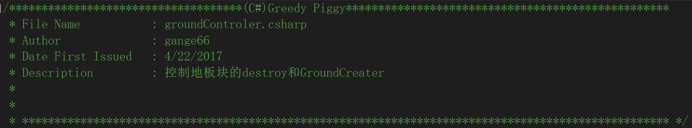
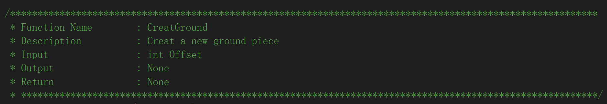
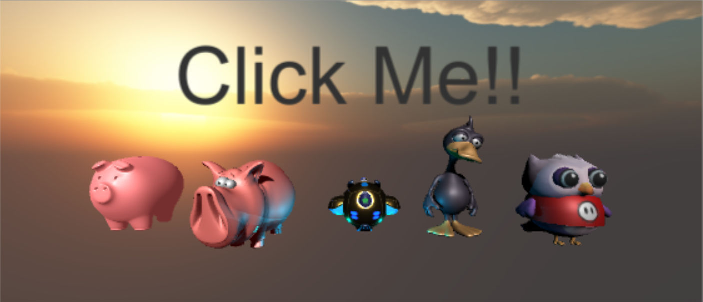
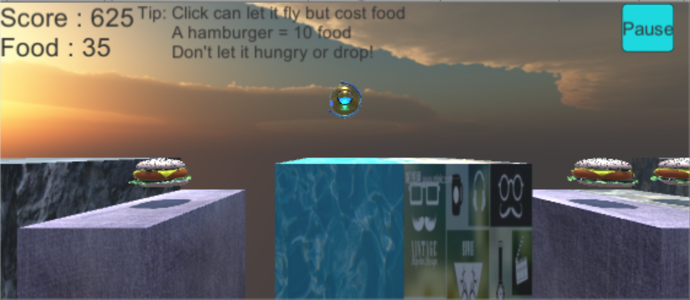
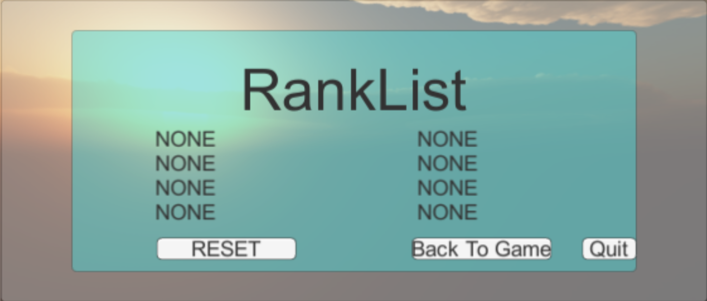

开发设计文档

计算机学院2016301500327肖轩淦

目录

1.  **开发规划**

问题定义：

玩家开始游戏时有一定的食物量，但之后必须通过拾取食物来维持生存。其飞翔会消耗额外的食物，其水平速度越快，消耗的食物也会越多。当玩家坠入悬崖或食物耗尽时，游戏结束。玩家得分即是其所走过的水平路程。

1.  **开发人员**

| 角色   | 主要职责 | 负责模块 | 人员   | 备注                |
|--------|----------|----------|--------|---------------------|
| 程序员 | 全部职责 | 全部模块 | 肖轩淦 | 学号：2016301500327 |

2.  **开发计划**

| 时间         | 计划                     |
|--------------|--------------------------|
| 2017.4.1-4.8 | 项目选题                 |
| 4.9-4.22     | 总体设计                 |
| 4.23-5.13    | 用简单几何体实现基本功能 |
| 5.14-5.27    | 设计UI界面               |
| 5.28-6.3     | 美化项目                 |
| 6.4-6.10     | 项目调试，漏洞检测       |

3.  **开发环境和工具**

| 工具               | 作用     |
|--------------------|----------|
| Visual Studio 2015 | 编辑代码 |
| Unity 5.4.1f1      | 设计场景 |
| 3ds max 2018       | 导入模型 |

4.  **开发规范**

| 类型               | 规范                                     |
|--------------------|------------------------------------------|
| 脚本路径规范       | Asset\\script\\xxx\\xxx.csharp           |
| 脚本说明规范（例） |  |
| 函数说明规范（例） |  |

5.  总体设计

    1.  概念术语描述

**场景**

\<游戏中的建筑、机械、道具、山石树木等元素构成的虚拟环境\>

**摄像机**

\<呈现在屏幕上的即是摄像机的视角\>

**地板块**

\<本游戏中玩家所通过的地面是由一块块地板块拼接而成的\>

1.  基本设计描述

本项目属于游戏类型，游戏内分为四个场景，分别是：StartUI（游戏开始时的UI界面）、choosePlayer（选择游戏角色）、maingamesence（主要游戏场景）、ranklist（排行榜）。

1.  *游戏玩法描述：*

玩家开始游戏时有一定的食物量，但之后必须通过拾取食物来维持生存。其飞翔会消耗额外的食物，其水平速度越快，消耗的食物也会越多。当玩家坠入悬崖或食物耗尽时，游戏结束。玩家得分即是其所走过的水平路程。

1.  *场景关系结构图：*

2.  主要界面流程描述

StartUI：

choosePlayer：

Maingamesence：

Ranklist：

1.  数据结构

本项目中实用数据结构较少，仅用几个数组PlayersName[]来储存保存的key、picture[]来储存需要用到的贴图

1.  模块设计

    1.  模块列表

| 模块名称           | 功能                             | 备注                                                       |
|--------------------|----------------------------------|------------------------------------------------------------|
| 控制玩家脚本模块   | 根据输入控制人物的移动等         | 路径：\\Assets\\scripts\\ mainGameScene\\player.cs         |
| 游戏主界面控制模块 | 控制场景的切换，计算分数、食物等 | 路径：\\Assets\\scripts\\ mainGameScene\\ GameControler.cs |
| 排行榜控制模块     | 读取本地排行榜数据               | 路径：\\Assets\\scripts\\ Ranklist\\ RankList_Control.cs   |

2.  脚本功能说明

| 所属场景      | 脚本名                            | 功能                                                                                                                     | 备注 |
|---------------|-----------------------------------|--------------------------------------------------------------------------------------------------------------------------|------|
| StartUI       | StartUI_BeginButton.cs            | 点击进入choosePlayer场景，切换字体颜色                                                                                   |      |
|               | StartUI_RankListButton.cs         | 点击进入Ranklist场景                                                                                                     |      |
| choosePlayer  | choosePlayer_camera.cs            | 使相机旋转，看到不同背景                                                                                                 |      |
|               | choosePlayer_Droid.cs             | 被选择角色脚本，控制器旋转，鼠标进入时，隐藏鼠标，放大角色，点击后切换场景并传参                                         |      |
|               | choosePlayer_Duck1.cs             | 同上                                                                                                                     |      |
|               | choosePlayer_pig1.cs              | 同上                                                                                                                     |      |
|               | choosePlayer_pig2.cs              | 同上                                                                                                                     |      |
|               | choosePlayer_pig3.cs              | 同上                                                                                                                     |      |
| Ranklist      | rank_backToGame.cs                | 点击进入BeginUI场景                                                                                                      |      |
|               | rank_QuitScript.cs                | 点击退出游戏                                                                                                             |      |
|               | rank_Reset.cs                     | 点击重置排行榜                                                                                                           |      |
|               | RankList_Control.cs               | 控制排行榜数据的生成                                                                                                     |      |
| MainGameScene | camera1.cs                        | 使摄像机跟随角色运动                                                                                                     |      |
|               | DiePanel_sumbitbutton.cs          | 若玩家进入排行榜，让玩家输入名字，记录排名                                                                               |      |
|               | FoodRest.cs                       | 控制食物剩余数量的显示及初始实物量                                                                                       |      |
|               | FoodScript.cs                     | 控制食物被拾取后的摧毁及增加食物剩余量                                                                                   |      |
|               | GameControler.cs                  | 根据choosePlayer场景传过来的参数确定使用的人物，检测玩家是否生存，玩家死亡后显示后续界面并将玩家得分与排行榜分数进行比较 |      |
|               | GroundCreatorScript.cs            | 游戏开始时创造新的地板块                                                                                                 |      |
|               | GroundScript.cs                   | 当玩家经过该地板块一段距离时，摧毁该地板块并生成新的地板块                                                               |      |
|               | light.cs                          | 控制灯光跟随玩家移动                                                                                                     |      |
|               | mainGameSence\_ pauseButton.cs    | 点击使游戏暂停/恢复                                                                                                      |      |
|               | maingamesence\_ RankListButton.cs | 玩家死亡后，点击进入Ranklist场景                                                                                         |      |
|               | player.cs                         | 读取鼠标输入控制玩家移动，控制玩家加速，更新得分，检测食物剩余                                                           |      |
|               | RetryButton.cs                    | 玩家死亡后，点击重新开始游戏                                                                                             |      |

3.  程序结构图

4.  算法描述

5.  当鼠标点击时，使player向上运动的方式是给其在y轴的速度在单位时间内加上一个值。而不是直接赋值给其在y轴的速度，也不是使其加速度改变，调试发现这两种方式使其难以落回摄像机的范围内。

6.  Player的水平速度在z，其加速度表达式为：$$\left(
    \frac{1}{\frac{z}{\text{maxSpeedZ}} + 0.1} - 0.8 \right)*0.5*acclerate$$

>   acclerate为public float，可在工程文件中对其修改。

1.  附录

2.  PlayerPrefs储存方式：

>   1、PlayerPrefs可以理解为持久化储存，还可以理解为游戏存档，
>   玩RPG游戏的时候肯定会有游戏存档
>   存档中就会记录玩家以前游戏的过程，这些都是以数据的形式存在PlayerPrefs中的。

>   2、在Mac OS
>   X上PlayerPrefs存储在～/Library/PlayerPrefs文件夹，名为unity.[company
>   name].[product name].plist，这里company和product名是在Project
>   Setting中设置的，相同的plist用于在编辑器中运行的工程和独立模式.

>   3、在Windows独立模式下，PlayerPrefs被存储在注册表的 HKCU\\Software\\[company
>   name]\\[product name]键下，这里company和product名是在Project
>   Setting中设置的.

>   4、在Web模式，PlayerPrefs存储在Mac OS X的二进制文件
>   \~/Library/Preferences/Unity/WebPlayerPrefs中和Windows的
>   %APPDATA%\\Unity\\WebPlayerPrefs中，一个游戏存档文件对应一个web播放器URL并且文件大小被限制为1MB。如果超出这个限制，SetInt、SetFloat和SetString将不会存储值并抛出一个PlayerPrefsException。

1.  游戏可能会受帧数影响

2.  游戏角色需使用\\Asset\\Material\\flexible.physicMaterial

3.  参考资料：

>   Unity Manual 用户手册：http://www.ceeger.com/Manual/
