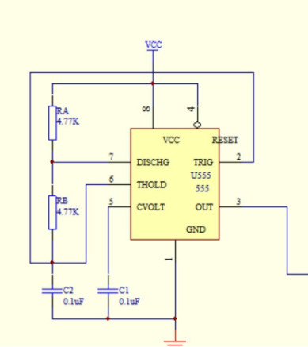
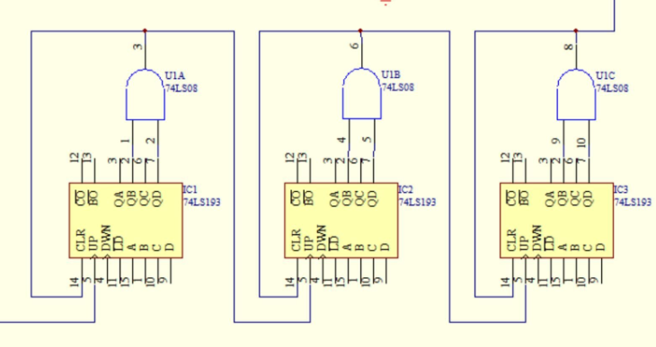
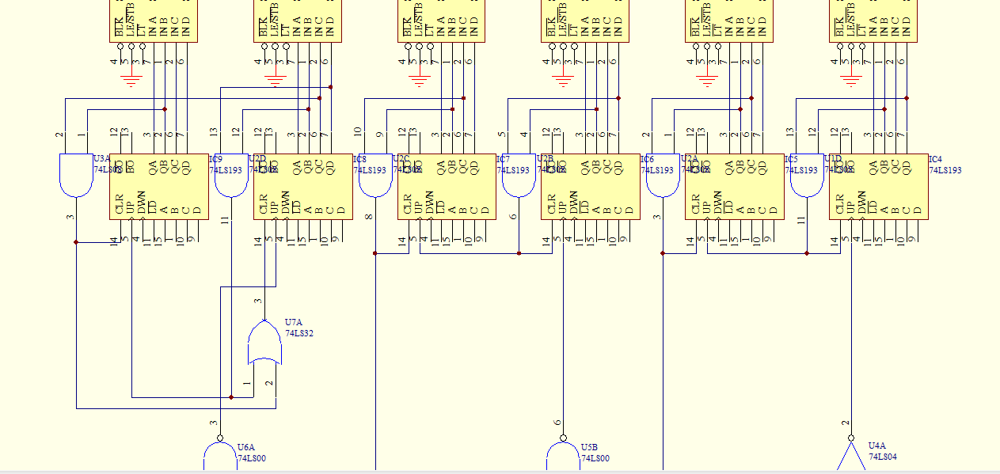
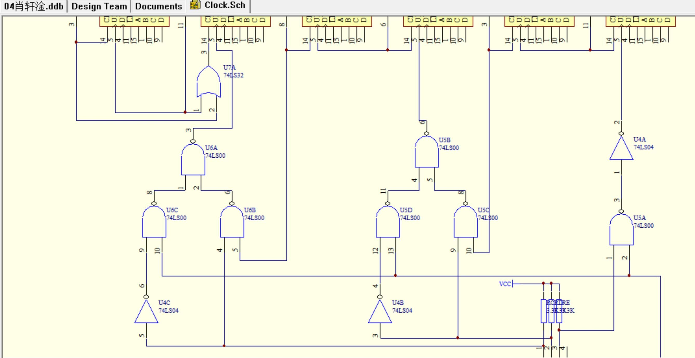
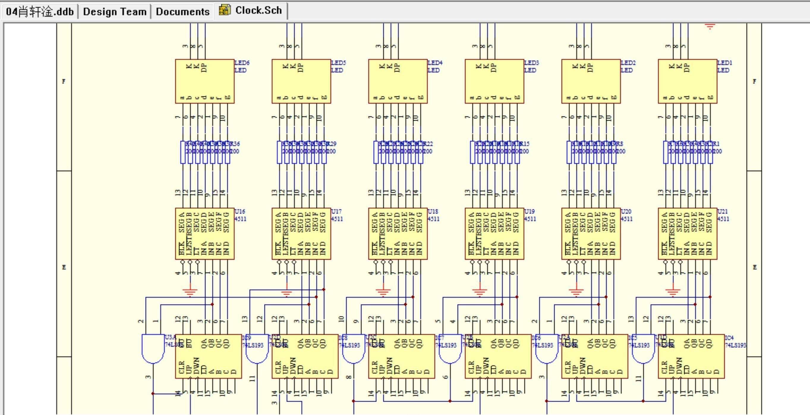
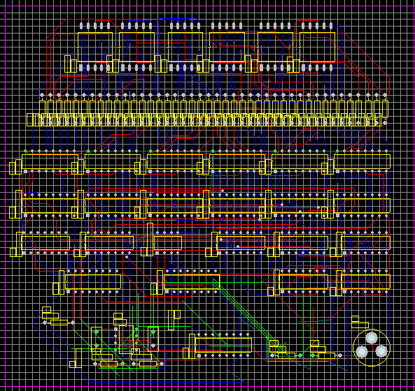
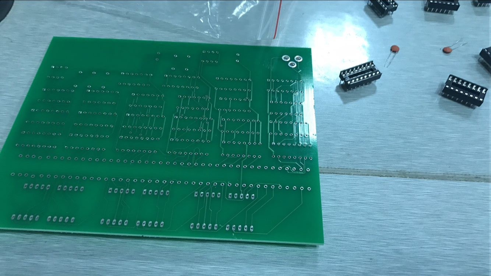
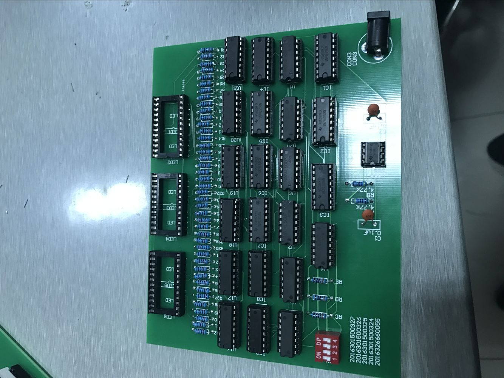
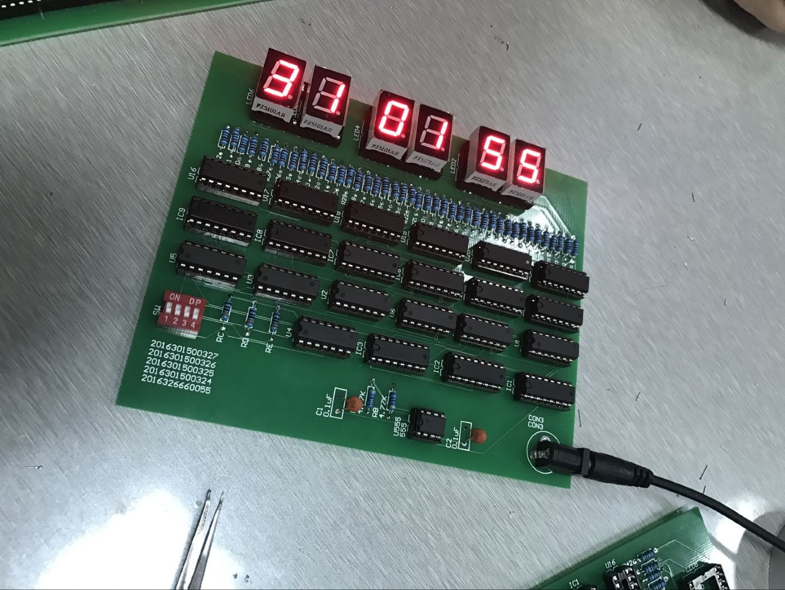

**数字逻辑实验课程**

**设 计 报 告**

题 目： *数 字 时 钟*

专业（班）： *计算机类11班12班*

项目组成员：*组长：肖轩淦 2016301500327*

*成员：田欢 2016301500326*

*郭宏宇 2016301500325*

*邹一鸣 2016301500324*

*周可 2016326660055*

*刘沁怡 2016301500365*

课程名称： *数字逻辑设计型实验*

任课教师： *肖忠付*

**武汉大学计算机学院**

2017 年11月  
**说 明**

1、数字逻辑实验课程设计结束之前，每位学生都必须参与《设计报告》的撰写工作，提交小组课程设计报告和个人总结报告（设计报告的第七部分）。

2、报告要求按如下内容项目撰写，条理清晰，内容详尽，数据准确。并以组为单位上交一份报告，但每位学生需自行撰写报告的个人总结报告部分，作为报告的一部分上交。

3、报告是数字逻辑实验课程设计评价的主要依据。指导教师将主要根据报告撰写情况、平时表现及每人的个人总结报告给予学生课程评分。不上交报告的学生将得不到实验课程成绩。

4、表格可做电子档或手写，上交报告用A4纸张统一打印或填写上交。此页请双面打印。

计算机学院教研办

2009年9月

**成绩：**

| 学号          | 姓名   | 小组课程设计成绩 | 个人报告成绩 | 总评成绩 |
|---------------|--------|------------------|--------------|----------|
| 2016301500327 | 肖轩淦 |                  |              |          |
| 2016301500326 | 田欢   |                  |              |          |
| 2016301500325 | 郭宏宇 |                  |              |          |
| 2016301500324 | 邹一鸣 |                  |              |          |
| 2016326660055 | 周可   |                  |              |          |
| 2016301500365 | 刘沁怡 |                  |              |          |

**教师评语：**

**任课老师签名：　　　　　　　　时间：**

**设　计　报　告　内　容　目　录**

1.  实验设计主题、内容、目标………………………………….5

2.  实验小组成员及分工情况…………………………………….5

3.  所需实验器材及功能描述、实验器材制作设计总结……….6

4.  实验设计原理………………………………………………….7

5.  安装调试步骤、设计过程…………………………………….10

6.  实验结论……………………………………………………...13

7.  个人总结报告及心得体会…………………………………...13

8.  实验设计主题、内容、目标

**1、实验设计主题**

设计一个满足以下要求的数字时钟：

①以信号发生器发生的稳定脉冲信号作为数字钟的计时基准；

②以时、分、秒为单位，以十进制的数字作为显示方式；

③小时计时为24进制，分钟和秒计时为60进制；

④可在任意时刻将当前时间调整为指定时间或归零。

**2、实验内容**

>   ①使用PROTEL99SE软件设计各单元电路电路图以及数字钟总电路接线图；

>   ②将原理图导出的PCB图送去制作电路板；

>   ③小组成员分工焊接，并对数字时钟进行调试。

**3、实验目标**

学习数字逻辑电路中定时器555与RC构成的多谐振荡器的工作原理及应用，采用中规模集成电路74LS90构成的分频电路，计数、译码显示等单元电路的综合应用。通过实际的设计过程和焊接操作，加深对数字逻辑课程中的基本知识、基本理论、常用元器件应用的理解，熟练掌握逻辑电路设计和分析的方法。

1.  实验小组成员及分工情况

肖轩淦（组长）：绘制原理图、PCB布局、电路板焊接

田欢：绘制原理图、电路板焊接

郭宏宇：绘制原理图、电路板焊接

邹一鸣：绘制原理图、电路板焊接

周可：绘制原理图、电路板焊接

刘沁怡：绘制原理图、实验报告撰写

1.  所需实验器材及功能描述、实验器材制作设计总结

**1、所需实验器材**

LED七段数码管、74LS00、74LS04、74LS08、74LS32、74LS193、CD4511（可用74LS48替换）、555定时器、SW、CON3、0.1uF电容、4.77KΩ电阻、3.3KΩ电阻、200Ω电阻、芯片底座、电焊笔、锡丝、松香、设计并制作好的电路板、电源线

**2、功能描述**

**LED七段数码管：**输出最终结果，显示及验证时间跳变和进位。

**74LS00：**4组 2 输入端与非门（正逻辑）。

**74L S04：**6非门(反相器)。

**74LS08：**4组2输入与门。

**74LS32：**4组2输入或门。

**74LS193：**同步四位二进制可逆计数器，双时钟输入，并具有异步清零和异步置数等功能。

**CD4511：**用于驱动共阴极 LED （数码管）显示器的 BCD
码-七段码译码器。价格比具有相同功能的74LS48便宜很多，可用性更强。

**555定时器**：产生时间延迟和多种脉冲信号，多个叠加使用使脉冲信号频率接近1Hz，达到模拟走时的效果。

**SW：**拨码开关，用于控制时分秒不同位上的走时，便于调整和检查。

**CON3：**三脚插座，用于将电路板与电源连接。

**电焊笔：**用于将芯片底座焊接到电路板上。

**锡丝：**用于冷却后将芯片底座固定在电路板上并导通电流。

**松香：**助焊剂。

**设计并制作好的电路板：**实验目标功能所需电路布局。

**电源线：**将板上的三孔插座与板外的电源连接。

**3、实验器材制作设计总结**

①用软件绘制原理图及生成PCB图时因注意布局合理性，在保证无错的前提下使布局尽量美观工整。注意使芯片缺口全部朝左（规范化），便于电路板的生产和芯片的插入。

②上交工程文件前应反复检查确保无误。

③芯片选用在性能相同时尽量选择市场上常见的便宜的，如74LS48就可用CD4511代替。芯片种类选择时应尽量精简并归类。

④确定好芯片种类和数量后，尽快进行设计所需软件的安装及调试，掌握使用方法并熟练操作。一般原理图和PCB图在重复绘制多次后可达到最佳效果。需注意各元件的参数设置及管脚封装无误。

⑤电焊时用电焊笔熔化适量锡覆盖在插口周围，包裹住芯片基座的针脚，形成小圆锥，在不浪费材料又美观的情况下保证焊通。

⑥电焊笔温度高小心使用，使用完毕及时断电。

1.  实验设计原理

数字时钟电路的工作原理：

由方波信号发生器产生稳定的高频脉冲信号，经过分频电路输出标准的脉冲信号，作为秒计时脉冲。秒计时脉冲计满60后向分计数器产生进位脉冲，分计时器计满60后向时计数器产生进位脉冲，时计数器按照模24的规律计数。计数器的输出经过显示译码器后送显示器显示。当电路计时出现误差时候，可以由校时电路分别对“时”、“分”、“秒”进行校准。

1.  **方波信号发生器原理**

方波信号发生器选取定时器555与RC构成的多谐振荡器。

1.  **分频电路设计原理**

分频电路的功能是对方波信号发生器产生的信号进行分频处理，产生计时所需的标准秒脉冲信号。

选取中规模集成电路74LS193构成分频电路产生所需的信号。

1.  **时、分、秒计时器设计**

数字钟的分、秒计时器均为模60计数器，十位计数器将74LS193连接成为模6计数器。数字钟的“时”计数器为模24计时器，运行到23时59分59秒时，在下一个秒时钟脉冲的作用下，数字钟显示为00时00分00秒。

1.  **校时电路设计**

校时电路的原理是采取秒计时器脉冲自动进行校时，拨动校时开关以后，在秒计时器的作用下，相应的计时器自动递增，直到增加到希望的值后再将校时开关拨动至初始状态。

1.  **译码显示电路设计**

译码器的作用是把时、分、秒计数器输出的4位二进制编码翻译后在七段数码管中显示。

完成各部分电路设计之后，按照总原理图进行组装，得到满足设计要求的数字时钟电路。

1.  安装调试步骤、设计过程

2.  设计绘制原理图

①启动原理图设计服务器

②按照规定设置图纸的大小

③将所需的元件库导入，具体的元素需要查表得到

④原理图布线

⑤检查原理图

2、绘制印刷电路模板

①启动印刷电路板设计服务器，建立PCB文档

②设置电路板的大小，并将其设置为双面板

③导入所需的元件封装库，具体所用器件通过查表得到

④将原理图元件导入到PCB电路版中，并将按合适位置摆放

⑤进行自动布线

3、实物焊接

①准备三块按照PCB电路图压制的电路板，一块练手，一块正式安装调试，一块备用。

②在能够熟练焊接元器件到电路板之后，将所有的元件底座焊接到电路板上。

③依次将元器件插到指定位置的底座上。

④焊接电容、电源、电阻、LED灯、三极管等元器件。

⑤连接电源，检测电路功能。

⑥实验结束，整理器材。

1.  实验结论

焊接过程中出现了接触不良的情况，在老师的指导和大家的细心操作下，焊接与调试完成了，这门课程的任务就此告一段落。

从最初的设计、布线到最后的焊接、测试，整个实验的过程是漫长的。它不仅考验了我们对电路元件原理的把握认识，也考察了小组成员的细心与耐心程度，这些对于动手实验的学习过程是必不可少的。也多亏了这次实验，让我们对这门课程有了更加深刻的理解和认识，同时对掌握知识的运用也更加熟练。

1.  个人总结报告

2.  肖轩淦

经过这次数字逻辑实验课，从设计电路板、调整pcb板，再到焊接完成，收获了太多太多。不仅学会了如何从零开始，设计一块能完成特定功能的电路板，而且还学会了PROTEL99SE软件的使用、焊电路时的各种细节，虽然没有什么焊电路板的经验，训练也不足。但随着练习了一下，焊得越来越多，也慢慢的熟练了起来，松香和焊锡也学会了使用。

虽然我们这一次大作业，一路上并不平坦，经历过挫折，但我们一起努力，克服了困难，最后完成了老师布置的任务。

1.  邹一鸣

这次数字逻辑实验，我收获了很多。一开始使用protel99se不太熟练，但是随着练习的深入，慢慢地掌握了使用方法。从做原理图开始一步步完成实验，在这个过程中，经历过失败，经历过困惑，但随着困难的一步步解决，也获得了成长。最后一起焊接电路板，一点一点把自己的作品打造出来的过程是美妙的，与队友的合作更是美好而难忘的。虽然最后作品不算完美，我们也分析了实验中的问题，完善了自己。

1.  田欢

这次数字逻辑实验我收获了很多，我学会了焊接，我发现焊接也是个很不容易的活稍不注意就会出错导致最后不能工作，而且在找错误也很不好找，所以焊接要细心，然后是与队友的合作是很重要的，队友往往能指出你的问题，最后还学会用了画图软件，收益颇多

4、周可

通过这次试验，我知道了很多：用电烙铁和焊锡丝在适当的位置点化形成水滴状的焊滴，在焊放阵脚元件时，要先将元件管脚选择合适的长度，这点可以根据元件自身的封装。点锡的过程是先将电烙铁放在焊盘上，然后将焊锡丝靠近焊盘，觉得锡量合适了先将焊锡丝移开，是焊锡成水滴状后将电烙铁移开

5、郭宏宇

完成这次数字逻辑的操作实验之后，我获得了很多感受。从最开始接触protel99这个软件，再到每一个元件的布置和接线，各种小小的细节汇聚在一起，才有了
最后完成的一块板子。这真的是一件让人小有成就感的事。毕竟要完成这样一块复杂的板子，各种管脚、接线等等，全都是细节，稍稍出错一处，就要花成倍的时间还发现并改正。但是这也磨练了我的意志和性格，让我能够不慌不忙的去做一件事，沉下气来钻研。还有，通过与小组成员之间的合作，我也认识到了团队的力量是无穷的。在交换彼此的意见和成果之时，很多问题迎刃而解。

6、刘沁怡

最初我是另一个小组的成员，参与了开始的制图环节。但此后我们组的原理图未能制成电路板，因此加入了其它小组进行相关实验。下面主要谈谈我对于软件制图的认识。

最开始的软件安装较为顺利，只是还需添加许多额外的库文件。实际开始作图后才发现，与以前的按部就班的实验过程不同，许多操作都有复杂的细节且容易出错，而出错之后又很难找到问题所在。所有的操作需要十足的耐心和细心，因此为了毕其功于一役，整体进度十分缓慢，对元件进行调整，间距、布局、器件的摆放都有要注意的细节...耗费了一周的时间，通过小组内相互交流，不断地向他人请教，集体学习视频内容，并与老师给出的逻辑图进行对比，终于完成了作图。

在作图的过程中，对原理的分析与对逻辑原理图的学习让我熟悉了各器件的工作原理及相应的引脚图，器件在加入硬件设计时的工作方式等。细致的工作则让我学习到了现实的具体工程中流程对思考和操作的严谨性的要求，充分体会了将课堂内容与生活实际相结合的过程是怎样的。

由于一些原因没能参加实验的焊接过程，我感到非常遗憾，但通过与现在小组成员的关于焊接过程的交流与进行实验报告的撰写，我也从某种程度上对这次的实验整体有了较为全面的了解与认识。总之，整个设计与操作过程中大家的合作十分重要，严密的任务更是让人步步仔细谨慎，这次的实验课让我获益匪浅。
