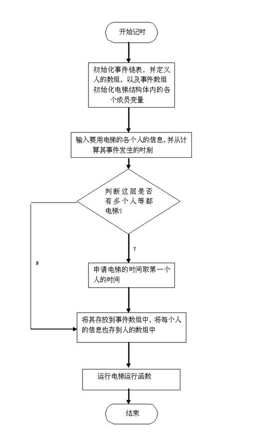
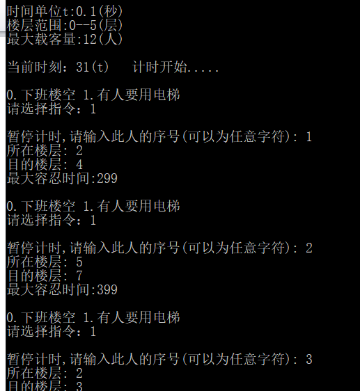
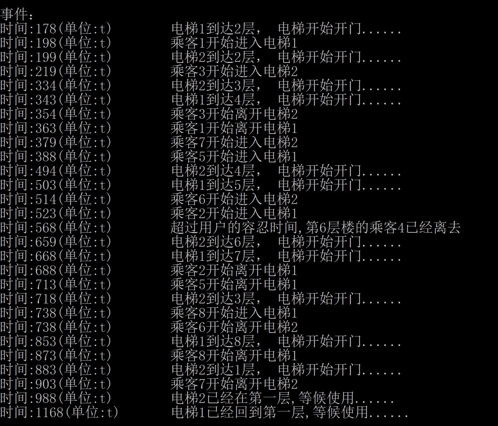
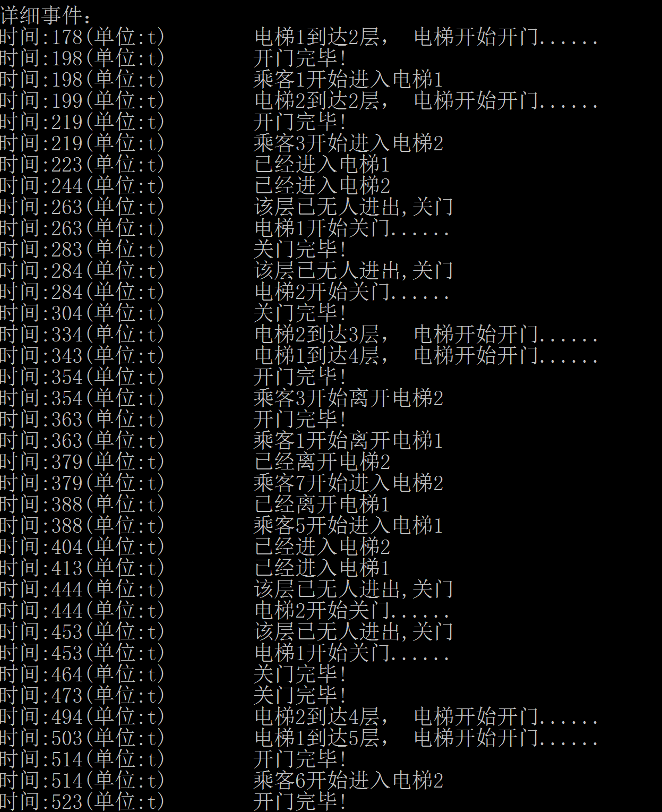
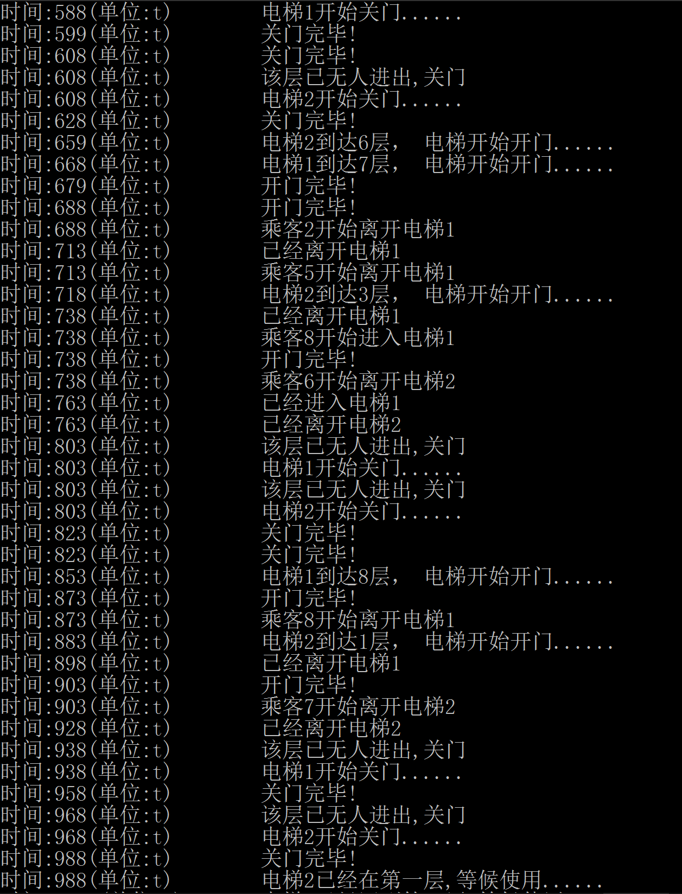

**武汉大学计算机学院**

**综 合 实 验 报 告**

课程名称 *　　 数据结构*

题 目 *电梯调度运行模拟*

小组成员 *肖轩淦 邹一鸣 郭宏宇*

>   *田欢 阿合玛拉丽·叶尔肯*

2017年 12 月 28 日

1.需求分析

计算机学院大楼地下1层，地上8层，装有两部电梯载人上下，每层楼电梯外的上下楼按钮信号两部电梯互通，上下楼请求信号发出后，根据一定的调度策略电梯停靠到相应楼层上下人。分析电梯运行情况，设计电梯调度运行策略，模拟实现电梯运行调度功能，使电梯快速准确地上下运行。当电梯空闲时，会停在地上一一层待命。乘客会随机进出任何一层，且对每位乘客来说，有一个最长的等待时间，当等待过长时，他将放弃。总的来说，当电梯停在某一层时不外乎三种情况：1.此层有个人{或有几个人}等候要用电梯
2.电梯中的某个人或者某几个人要在该楼层下
3.则是前面两种情况的结合，此时情况相当复杂，因为，题目要求电梯开门和关门都要消耗一定的时间（题目中没有提电梯上升或者下降一层需要多少时间，所以不妨就假定为30t），而且人进电梯和人出电梯时也要消耗一定的时间，这说明了当同一时刻有至少两个以上的人要进行同一种动作的时候（比方说都是要出电梯，或都是在某一层等电梯，电梯来了后都要进去），但是因为每个人进出电梯都要消耗时间，所以不能单纯的同时让这些人同进或同出电梯，而是要有先后顺序的进出，此为其一………

其二，题目中还提到每个人等候电梯到来时，都有一个容忍时间（每个人不一定相同），所以，万一，在他按下按钮到电梯开到他所在的那层楼的间隔时间大于他的最大容忍时间，他会先行离开，但这一切电梯并不知道啊，所以电梯依旧会按照每个申请使用电梯的时间进行服务，正是因为这样，极有可能发生这样的情况：电梯开到某层后打开电梯门，但是既没有人出去，也没有人进来………

其三，根据题目中的要求，当电梯停在某层时候，有人进出，电梯每隔40t测试一次，若无人进出，则关门，关门完后，若300t时间内没有人使用，则自动开到第1层等候下次的使用（电梯“空闲”时，将来到该层候命）等等等等…………以上各种情况（还有一些情况这里没列举）都是要在做这道题时需要考虑的。

2.概要设计

本程序中所以的抽象数据类型及相应的操作函数如下：

电梯结构体dianti

/\*此电梯结构体包括了电梯所在楼层，最大载客量以及电梯门的开关状态（0为关，1为开），定义电梯门的开关状态并不是多次一举，而是当电梯出现局部的重复动作时，会导致程序的失败。\*/

人结构体man

/\*在该结构体中，定义了用于区别个人的代号，最大容忍时间，他的出发楼层以及目标楼层，还有两个标记，用于标记此人是否在电梯中已经是否已经使用过了电梯。\*/

事件结构体的结点SLNode

/\*其中分别定义了事件的信息，要发生的时刻以及指向下一个事件的指针。\*/

void ListInitiate(SLNode\*\*head)

/\*初始化链表\*/

void LinListSort(SLNode \*head)

/\*用按发生时间的顺序给事件链表中的事件排序\*/

void Destroy(SLNode \* \*head)

/\*销毁链表\*/

void OPEN(SLNode \*head,dianti dt,int now)

/\*电梯开门函数，将电梯开门的事件信息插入到事件链表中去\*/

void CLOSE(SLNode \*head,dianti dt,int now)

/\*电梯关门函数，将电梯关门的事件信息插入到事件链表中去\*/

void GET_IN(SLNode \*head,dianti dt,int now)

/\*人进电梯的函数，将人进电梯时候的各种信息插入到事件链表中去\*/

void GET_OUT(SLNode \*head,dianti dt,int now)

/\*人出电梯的函数，将人出电梯时候的各种信息插入到事件链表中去\*/

注释：以上四个函数基本是用来完成人和电梯的动作序列

int gettime(SLNode \*head)

/\*返回最新事件（即事件链表最后一个结点）的发生时间\*/

void print(SLNode \*head)

/\*将事件链表中的事件一一显示出来，即为最后显示电梯和人动作序列的函数\*/

int fenpei(int num, man ren[], clock_t shijian[], man \* &dt1, int &dt1ptr ,
clock_t shijian1[], man \* &dt2, int &dt2ptr, clock_t shijian2[])

/\*将等待队列分为两个，交给两部电梯执行\*/

void Go(SLNode \*head,int n,dianti dt,clock_t s[1000],man r[1000])

/\*电梯运行函数，根据申请使用电梯的所有人的信息，以及所有事件发生时的时刻，将所有情况的处理都放在在其中\*/

Go函数的流程图如下：

3.详细设计

本程序中的一些结构体及相应函数的伪代码如下：

typedef struct

{

char name[50];//电梯名称

int lc;//电梯所在楼层

int rs;//电梯中的人数,规定最大乘坐人数为12

int door;//门的状态 0关1开

}dianti;

typedef struct

{

char name[50]; //这个人的名字或序号(以示区别)

int rrsj;//一个人的容忍时间

int lc;//所在楼层

int md;//目的楼层

int biaozhi;
//此标志位记录人使用电梯是否完成或者是否离去,为1表明使用过(离去),否则为0

int in; //标志位,为1时表明人在电梯中,否则为0

int cha;

}man;

typedef struct Node

{

char a[1000];//事件信息

int mytime;//事件所发生的时间

struct Node \*next;

}SLNode

本程序以事件链和电梯运行函数为核心，在初始的情景下输入相应的信息对事件链初始化，然后也会涉及链表的插入、删除和销毁等操作。运行时，依据时间给事件排序，如下：

//用按发生时间的顺序给事件排序

void LinListSort(SLNode \*head)

{

SLNode \*curr,\*pre,\*p,\*q;

p=head-\>next;

head-\>next=NULL;

while(p!=NULL)

{

curr=head-\>next;

pre=head;

while(curr!=NULL && curr-\>mytime\<=p-\>mytime){

pre=curr;

curr=curr-\>next;

}

q=p;

p=p-\>next;

q-\>next=pre-\>next;

pre-\>next=q;

}

}

/\*

电梯动作： 1.开始开门,20t,开门结束;

2.开始关门,20t,关门结束;

3.从n-1层开始移动,30t,到达第n层;

4.开始等待,有人来或者300t,等待结束;

人的动作： 1.开始等待,x\<=最大容忍时间,等待结束;

2.开始进门,25t,进门结束;

3.开始出门,25t,出门结束;

\*/

//电梯开门

void OPEN(SLNode \*head, dianti dt, int now)

{

char a[1000] = { }, b[1000] = { "开门完毕!" }, temp3[10] = { "到达" }, temp[10],
temp2[100] = { "层， 电梯开始开门......" };

strcat(a, dt.name);

strcat(a, temp3);

itoa(dt.lc, temp, 10);

strcat(a, temp);

strcat(a, temp2);

ListInsert(head, g, a, now);

g++;

ListInsert(head, g, b, now + 20);

g++;

dt.door = 1; //门的状态为开

}

//电梯关门

void CLOSE(SLNode \*head, dianti dt, int now)

{

char a[1000] = { }, b[1000] = { "关门完毕!" };

char temp[50] = { "开始关门......" };

strcat(a, dt.name);

strcat(a, temp);

ListInsert(head, g, a, now);

g++;

ListInsert(head, g, b, now + 20);

g++;

dt.door = 0; //门的状态为关

}

//人进电梯

void GET_IN(SLNode \*head, dianti dt, int now, char name[])

{

char a[1000] = { }, b[1000] = { "已经进入" }, temp[50] = { "开始进入" };

strcat(a, name);

strcat(a, temp);

strcat(a, dt.name);

strcat(b, dt.name);

ListInsert(head, g, a, now);

g++;

ListInsert(head, g, b, now + 25);

g++;

dt.rs++; //电梯人数加一个

}

//人出电梯

void GET_OUT(SLNode \*head, dianti dt, int now, char name[])

{

char a[1000] = { }, b[1000] = { "已经离开" }, temp[50] = { "开始离开" };

strcat(a, name);

strcat(a, temp);

strcat(a, dt.name);

strcat(b, dt.name);

ListInsert(head, g, a, now);

g++;

ListInsert(head, g, b, now + 25);

g++;

dt.rs--; //电梯中的人数减一个

}

//返回最新事件（即事件涟表最后一个结点）的发生时间

int gettime(SLNode \*head)

{

SLNode \*pre, \*curr;

curr = head-\>next;

pre = head;

while (curr != NULL) {

pre = curr;

curr = curr-\>next;

}

return pre-\>mytime;

}

电梯运行函数是整个程序的主体部分，他以用户输入到事件链中的数据为依据，再结合电梯运行过程中的后续输入和控制依照时间的进行不断处理并得出结果，是能够完成模拟电梯运行调度的核心。

4.使用说明、测试和分析结果

使用说明：进入程序后，输入任意键开始运行，输入指令1开始接受第一个用户的信息，包括其代号、所在楼层和目标楼层。此后若有其他用户，继续输入指令1添加其信息，所有用户信息输入完毕之后，输入指令0，程序按照后台的时间自动执行各指令，并显示电梯的运行结果。

下面是程序的测试结果：

1.  运行程序后，按任意键开始，连续输入指令1，向事件链中添加事件。

1.  乘客信息全部输入完毕后，输入指令0，程序开始模拟电梯运行情况，并输出电梯的运行过程：

>   测试数据：1 乘客1 2 4 299 1 乘客2 5 7 399 1 乘客3 2 3 399 1 乘客4 6 5 399 1
>   乘客5 4 7 499 1 乘客6 4 3 799 1 乘客7 3 1 899 1 乘客8 7 8 899 0

>   输出结果：

详细事件：

其中包含电梯按照时间顺序的运行结果，以及是否有因等待时间过长而离开的乘客。

3.结果分析：

平均等待时间：

(254+579+281+721+444+576+441+794)/8-27（初始时间）=484

空载率：

(2+1+3+2+3+1)/(7+3+3+1+6+1+2+2)=48%

电梯1：(2+1+3)/(7+3+3+1)=42.85%

电梯2：(2+3+1)/(6+1+2+2)=54.54%

5.扩展题目

**题目要求**

>   某高校的一座30层住宅楼有两部电梯，每梯最多载客10人。大楼每层4户，每户平均3.5人，每天早晨平均每户有3人必须在7时之前离开大楼去上班或上学。模拟该电梯系统，并分析分别在一梯和两梯运行情况下，下楼高峰期间各层的住户应提前多少时间候梯下楼？研究多梯运行的最佳策略。

**题目分析**

本题为给定乘客的理想运行策略问题。即要求找到最短时间运送完所有乘客的策略。本组选择找出几种可能的运输策略，比较时间长短确定最佳策略并进一步确定多梯运行最佳策略。

**题目假设**

假设乘客都可以按照规定时间出发等候电梯

假设电梯停止与上下乘客时间忽略不计

假设从电梯第一次接到人开始计算运行总时间（即第一次从一楼运行到对应楼层时间不计）

**题目解答**

设电梯运行一层所需时间为t。

**一、一梯情况**

>   由于每层楼都有12人需要下楼而一座电梯最多只能载十人，所以一次性最大地装同一层楼的乘客显然是比较好的选择。一梯情况下我们提出了两种策略。

**1.**先将一层楼的10名乘客运送下去，然后剩余的2名乘客五层为一组地运输下去。

同一层十人运输所需的总时间T1

**T1=（30t+2t）\*29/2\*2-30=898t**

五层一组运输总时间T2

**T2=(30+2\*（25+20+15+10+5))\*t=180t**

总时间T

**T=T1+T2=1078t**

>   **2.**从30层开始，先运10人，然后运输剩下2人和29层8人，经过枚举五层为一组，需要六次运输，多的一次时间为最高层时间。

总时间T

**T=[（30+2\*(30+29+28+27+26)）+2\*（……）+2\*（5+5+4+3+2）]\*t=1078t**

>   可以发现，两种策略在一梯情况下所需时间相同，但是第一种策略下，每层楼有两名乘客等待时间过长，需要等五层楼的运输时间（若先运输这五层各两名乘客，则会提早至少四层乘客的推荐到达时间）。而相比之下第二种策略只需要等待电梯最多一次运行。

>   综上所述，我们认为第二种策略为一梯情况下的最优运行策略。

>   **二、二梯情况**

>   二梯情况属于基于一梯情况的优化，但是基本运输策略没有改变。我们依旧分析两种策略。

>   **1.**一梯先进行一层十人的运输，二梯进行五层一组的运输，由于五层一组运输所需时间远小于一梯，所以运行完后帮助一梯。理想情况下对两梯运输进行分配使得效率最大化。

>   二梯一阶段所需时间T1

>   **T1=180t**

>   此时给一梯分配第30,28,27,20层的运输刚好执行完毕。

>   剩下的通过分组，可求得最佳分组情况下花费最长时间的一梯所需时间T2

>   **T2=322t**

>   总时间T

>   **T=T1+T2=502t**

>   **2.**两梯分别进行一梯情况下的第二种运输方案，具体行动举例为：

| 一号 | 二号 |
|------|------|
| 30   | 30   |
| 29   | 28   |
| 27   | 26   |
| ……   | ……   |

>   第二个五层交换一二号电梯先后顺序，可以抵消第一个五层造成的时间差，以此类推，到二层运完两梯同时结束运行。所需时间T

>   **T=（（30+29+27+25+23+21+20+……+5+3）\*2-30）\*t=638t**

>   可以发现，策略一时间上大幅度优于策略二，所以我们认为策略一是二梯情况下的最优策略。

>   **三、多梯情况下的最佳策略**

>   由前面解答，我们发现，一梯情况下所需时间相同的策略在二梯情况时出现了差别，具体为策略一优于策略二。由于多梯情况相当于二梯情况的迭代版本，所以我们认为：

>   **设每层满载所需总时间为T1，五层一组每层两人运输所需时间为T2，电梯台数为n**

>   **当T1\>=T2/(n-1)时，一号电梯先进行五层一组每层两人运输，余下电梯进行单层满载运输，一号运输完毕后帮助分担。**

**当T1\<T2/(n-1)时，一号进行五层一组每层两人运输，余下先进行单层运输，完成后帮组一号分担。**

6.综合实验总结

这次的综合实验对我们小组的成员来说是一次磨练，起初我们认为这个问题的难度并不是很大。但是在开题之后的讨论中，我们便在商讨如何模拟电梯处理这些指令的问题上遇到了瓶颈。经过一番讨论，我们从以指令为顺序，改变为以时间为顺序，并取消了对指令优先级排序的想法。另外，我们起初准备用栈和队列来实现指令的存储以及执行顺序，但是由于不同的组员的算法功底的差异，最终决定以较为基础的单链表作为实现本程序的基本数据结构。另外，本次实验设计感觉最难的就是设计思想，你该怎样实现模拟电梯？如何模拟？怎样模拟？等等，情况非常复杂。做完这道题以后，收获还是不少的，也意识到前期的准备工作是如此的重要，在写程序之前最好先做个整体的设计思想的规划，充分考虑各种情况，保证设计的思想在方向上是对的，以及敲代码的时候一定要静下心，不过由于能力问题，算法还是显得过于臃肿，不够精练。

6.小组成员分工及工作评价（组长对各成员的工作进行评价，用百分制来评价）

肖轩淦 负责PPT制作主讲以及函数主体的编写，统筹安排小组工作 100

邹一鸣 研究拓展要求中多梯运行的最佳策略与部分函数的编写 100

郭宏宇 按照模板完整编写实验报告及完成成员评价与心得与部分函数的编写 100

田欢 设计一种算法将一组指令分给两组电梯运行，并尽可能高效 100

阿合玛拉丽·叶尔肯 参与算法设计的讨论以及部分函数的编写 100
