**武汉大学计算机学院**

**实 验 报 告**

课程名称 *　 计算机组成原理*

题 目 *　 MIPS CPU设计*

专业班级 *信安四班*

学 号 *2016301500327*

学生姓名 *肖轩淦*

指导教师 *刘芹*

| 评语： |
|--------|

指导教师： 2018年 月 日

**设计任务书**

| **主要内容** 用硬件描述语言（Verilog）设计MIPS流水线CPU，支持如下指令集： add, sub, and, or, slt, addi, lw, sw, beq, j, sll, lui, slti, bne, ori, andi, srl，jal, jr和jalr, addu, subu指令。用仿真软件Modelsim对有数据冒险和指令冒险的汇编程序进行仿真。                                                                                                                                                                                                                                                                                               |
|--------------------------------------------------------------------------------------------------------------------------------------------------------------------------------------------------------------------------------------------------------------------------------------------------------------------------------------------------------------------------------------------------------------------------------------------------------------------------------------------------------------------------------------------------------|
| **基本要求** 1. 熟悉硬件描述语言（Verilog）和仿真软件Modelsim； 2. 用硬件描述语言（Verilog）设计如下单周期和流水线模块： （1）程序计数器模块（flopr）； （2）指令存储器模块（imem）； （3）寄存器模块（regfile）； （4）流水线寄存器（IFIDreg、IDEXreg、EXMEMreg、MEMWBreg）； （5）数据扩展模块（signext）； (6)运算器模块（ALU）； (7)数据存储器模块（dmem）； （8）控制器模块（ControlUnit）； （9）整机连接模块（MIPS）（包括数据冒险和指令冒险检测）； （10）流水线连接模块（pipelinetop） （11）单周期顶层模块（top） 3.完成汇编程序的仿真调试。 |
| **参考资料** 【1】计算机原理与设计：Verilog HDL版，李亚民 著                                                                                                                                                                                                                                                                                                                                                                                                                                                                                           |

  
**目 录**

[1.需求分析 1](#需求分析)

[2.实现功能 1](#实现功能)

[3.概要设计 2](#概要设计)

>   [3.1 flopr（程序计数器） 3](#flopr程序计数器)

>   [3.2 regfile（寄存器）设计 3](#regfile寄存器设计)

>   [3.3 ALU（算术逻辑运算单元） 4](#alu算术逻辑运算单元)

>   [3.4 signext（扩展单元） 5](#signext扩展单元)

>   [3.5 dmem（数据存储器） 5](#dmem数据存储器)

>   [3.6 imem（指令存储器） 6](#imem指令存储器)

>   [3.7 ControlUnit（控制器） 6](#controlunit控制器)

>   [3.8 MIPS（模型机） 7](#mips模型机)

>   [3.9 Pipelinetop（流水线顶层文件） 8](#pipelinetop流水线顶层文件)

>   [3.10 testbench（测试模块） 8](#testbench测试模块)

>   [3.11 IF（流水线的IF模块） 9](#if流水线的if模块)

>   [3.12 IFIDreg（流水线的IF/ID流水线寄存器模块）
>   9](#ifidreg流水线的ifid流水线寄存器模块)

>   [3.13 ID（流水线的ID模块） 10](#id流水线的id模块)

>   [3.14 EXE（流水线的EXE模块） 11](#exe流水线的exe模块)

>   [3.15 MEM（流水线的MEM模块） 12](#mem流水线的mem模块)

>   [3.16 WB（流水线的WB模块） 13](#wb流水线的wb模块)

[4.单周期CPU详细设计 13](#单周期cpu详细设计)

>   [4.1 单周期CPU总体结构 13](#单周期cpu总体结构)

>   [4.2 flopr（程序计数器） 14](#flopr程序计数器-1)

>   [4.3 regfile（寄存器）设计 15](#regfile寄存器设计-1)

>   [4.4 ALU（算术逻辑运算单元） 15](#alu算术逻辑运算单元-1)

>   [4.5 signext（扩展单元） 17](#signext扩展单元-1)

>   [4.6 DMEM（数据存储器） 18](#dmem数据存储器-1)

>   [4.7 IMEM（指令存储器） 19](#imem指令存储器-1)

>   [4.8 controller（控制器） 19](#controller控制器)

>   [4.9 MIPS（模型机） 23](#mips模型机-1)

[5.流水线详细设计 24](#流水线详细设计)

>   [5.1CPU总体结构 24](#cpu总体结构)

>   [5.2 flopr（程序计数器） 26](#flopr程序计数器-2)

>   [5.3 regfile（寄存器） 27](#regfile寄存器)

>   [5.4 ALU（算数逻辑运算单元） 28](#alu算数逻辑运算单元)

>   [5.5 signext（扩展单元） 30](#signext扩展单元-2)

>   [5.6 dmem（数据储存器） 30](#dmem数据储存器)

>   [5.7 imem（指令寄存器） 31](#imem指令寄存器)

>   [5.8 ControlUnit（控制器） 31](#controlunit控制器-1)

>   [5.9 Pipelinetop（流水线顶层文件） 37](#pipelinetop流水线顶层文件-1)

>   [5.10 testbench（测试模块） 40](#testbench测试模块-1)

>   [5.11 IF（流水线IF模块） 41](#if流水线if模块)

>   [5.12 IFIDreg（流水线IF/ID流水线寄存器模块）
>   42](#ifidreg流水线ifid流水线寄存器模块)

>   [5.13 ID（流水线ID模块） 43](#id流水线id模块)

>   [5.14 IDEXEreg（流水线ID/EXE流水线寄存器模块）
>   46](#idexereg流水线idexe流水线寄存器模块)

>   [5.15 EXE（流水线EXE模块） 48](#exe流水线exe模块)

>   [5.16 EXEMEMreg（流水线EXE/MEM流水线寄存器模块）
>   49](#exememreg流水线exemem流水线寄存器模块)

>   [5.17 MEM（流水线MEM模块） 51](#mem流水线mem模块)

>   [5.18 MEMWBreg（流水线MEM/WB流水线寄存器模块）
>   51](#memwbreg流水线memwb流水线寄存器模块)

>   [5.19 WB（流水线WB模块） 53](#wb流水线wb模块)

[6.测试和结果分析 53](#测试和结果分析)

>   [6.1测试文件 mipstest_pipelined.asm 53](#测试文件-mipstest_pipelined.asm)

>   [6.2测试机器码 mipstest_pipelined.asm
>   55](#测试机器码-mipstest_pipelined.asm)

>   [6.3 测试结果分析（下面的指令均在流水线下运行）
>   56](#测试结果分析下面的指令均在流水线下运行)

>   [6.3.1 ori \$1, \$1, 0x2211指令 56](#ori-1-1-0x2211指令)

>   [6.3.2 andi \$3, \$2, 0x2333指令 57](#andi-3-2-0x2333指令)

>   [6.3.3 bne \$2, \$2, end指令 58](#bne-2-2-end指令)

>   [6.3.4 bne \$2, \$1, end指令 59](#bne-2-1-end指令)

>   [6.3.5 lui \$1, 0x1000指令 59](#lui-1-0x1000指令)

>   [6.3.6 add \$3, \$1, \$1指令 60](#add-3-1-1指令)

>   [6.3.7 slt \$4, \$1, \$2指令 61](#slt-4-1-2指令)

>   [6.3.8 sltu \$4, \$1, \$2指令 62](#sltu-4-1-2指令)

>   [6.3.9 j a指令（控制冒险） 62](#j-a指令控制冒险)

>   [6.3.10 jal b指令(控制冒险) 63](#jal-b指令控制冒险)

>   [6.3.11 jr \$31指令 64](#jr-31指令)

>   [6.3.12 lw \$7, 72(\$3) sw \$7, 68(\$3)指令（数据相关、暂停）
>   64](#lw-7-723-sw-7-683指令数据相关暂停)

>   [6.3.13 jalr \$3指令 65](#jalr-3指令)

>   [6.3.14 addi \$2, \$0, 1与addi \$3, \$2, 1 指令（数据相关，EXE到ID级旁路）
>   66](#addi-2-0-1与addi-3-2-1-指令数据相关exe到id级旁路)

>   [6.3.15 lw \$4, 0(\$3)（数据相关，MEM到ID级旁路）
>   66](#lw-4-03数据相关mem到id级旁路)

[7.课程设计总结 67](#课程设计总结)

1.需求分析
==========

学习了计算机组成原理课程后需要融会贯通计算机组成与设计课程所教授的知识，通过对知识的综合应用，加深对CPU系统各模块的工作原理及相互联系。

通过课程设计来学习单周期CPU的工作原理和基于Verilog的硬件描述语言来设计CPU的方法，掌握采用Modelsim仿真技术进行调试和仿真的技术，培养科学研究的独立工作能力和分析解决问题的能力，取得CPU设计与仿真的实践和经验。

因此本课程设计是很有必要的。

2.实现功能
==========

单周期：

256K RAM

128K Cache

The processor support follow insrtuction

1 TYPE-R: AND, OR, ADD, SUB, SLT, NOR, SRL

2 TYPE-I: ADDI, ANDI, ORI, XORI, LUI, SLTI

3 MEM: LW, SW

4 BRANCH: BEQ, BNE

5 JUMP: J, JAR, JR, JALR

流水线：

A classic 5-stage pipeline MIPS 32-bit processor.

1.  256K RAM

2.  128K Cache

3.  5 stage: Fetch, Decode, Execute, Memory and Write back

4.  The processor support follow insrtuction

>   1 TYPE-R: AND, OR, ADD, SUB, SLT, NOR, SRL

>   2 TYPE-I: ADDI, ANDI, ORI, XORI, LUI, SLTI

>   3 MEM: LW, SW

>   4 BRANCH: BEQ, BNE

>   5 JUMP: J, JAR, JR, JALR

一、 单周期和流水线均实现了add, sub, and, or, slt, addi, lw, sw, beq, j, sll,
lui, slti, bne, ori, andi, srl，jal, jr和jalr,addu, subu指令。

二、 区分了有符号数和无符号数的实现（addu/add，slt/sltu, subu/sub）

三、
流水线提交的源代码默认执行mipstest_pipelined.dat文件，对应mipstest_pipelined.asm。单周期默认执行mipstest_ext.dat，对应mipstest.asm

四、 代码已托管至https://github.com/GANGE666/MIPS-Cup-Verilog

3.概要设计 
===========

以下均为流水线模块的概要设计。

3.1 flopr（程序计数器）
-----------------------

**（1）功能描述**

储存pc的值并输出，并在下一个时钟上升沿写入下一个pc的值。具有阻塞功能。

**（2）模块接口**

| 信号名  | 方向   | 描述         |
|---------|--------|--------------|
| Clk     | Input  | 时钟信号     |
| Reset   | Input  | 复位信号     |
| Wpcir   | Input  | 阻塞信号     |
| d[31:0] | Input  | 下一条pc输入 |
| q[31:0] | Output | 将当前pc输出 |

3.2 regfile（寄存器）设计
-------------------------

**（1）功能描述**

模拟寄存器，实现32个32位寄存器的存储，读取

**（2）模块接口**

| 信号名    | 方向   | 描述               |
|-----------|--------|--------------------|
| Clk       | Input  | 时钟信号           |
| We3       | Input  | 写信号             |
| Ra1[4:0]  | Input  | rs寄存器号         |
| Ra2[4:0]  | Input  | rt寄存器号         |
| Wa3[4:0]  | Input  | 写寄存器号         |
| Wd3[31:0] | Input  | 写入数据           |
| Rd1[31:0] | Output | Rs寄存器读出的数据 |
| Rd2[31:0] | Output | Rt寄存器读出的数据 |

3.3 ALU（算术逻辑运算单元）
---------------------------

**（1）功能描述**

ALU主要功能是完成对输入数据的进行有/无符号加法、减法、小于置位和与、或、异或、左移、右移运算以及判断两个操作数是否相等。

**（2）模块接口**

| 信号名          | 方向 | 描述                                                                                                                                                                                                     |
|-----------------|------|----------------------------------------------------------------------------------------------------------------------------------------------------------------------------------------------------------|
| A [31:0]        | I    | 操作数A                                                                                                                                                                                                  |
| B [31:0]        | I    | 操作数B                                                                                                                                                                                                  |
| alucontrol[3:0] | I    | 需要进行的运算 0000：与 0001：或 0010：有符号加法 0101：异或 0110：有符号减法 0111：有符号小于则置位 1000：左移 1001：立即数置高16位 1010：右移 1011：无符号加法 1100：无符号减法 1101：无符号小于则置位 |
| Zero            | O    | 两操作数是否相等                                                                                                                                                                                         |
| aluout [31:0]   | O    | 运算结果                                                                                                                                                                                                 |

3.4 signext（扩展单元）
-----------------------

**（1）功能描述**

signext主要功能是将16位的数据按照指令扩展为32位数据。

**（2）模块接口**

| 信号名              | 方向 | 描述                                                |
|---------------------|------|-----------------------------------------------------|
| a[15:0]             | I    | 需要进行扩展的数据                                  |
| signextsignal [1:0] | I    | 扩展方式的控制信号 00：符号扩展 01：0扩展 11：1扩展 |
| y[31:0]             | O    | 扩展结果                                            |

3.5 dmem（数据存储器）
----------------------

**（1）功能描述**

Dmem的主要功能是储存和读取在数据储存器中的数据。

大小32x64位，共256KB

**（2）模块接口**

| 信号名   | 方向 | 描述           |
|----------|------|----------------|
| Clk      | I    | 时钟信号       |
| We       | I    | 写信号         |
| A[31:0]  | I    | 访问的储存器号 |
| Wd[31:0] | I    | 写入的数据     |
| Rd[31:0] | O    | 读取的数据     |

3.6 imem（指令存储器）
----------------------

**（1）功能描述**

Imem的主要功能是，根据所输入的pc，输入相对应的指令

**（2 ）模块接口**

| 信号名   | 方向 | 描述         |
|----------|------|--------------|
| A[5:0]   | I    | Pc值         |
| Rd[31:0] | O    | pc对应的指令 |

3.7 ControlUnit（控制器）
-------------------------

**（1）功能描述**

controlUnit的主要功能是根据指令的op和funct，输出相应的控制信号，并控制冒险与阻塞

**（2 ）模块接口**

| 信号名          | 方向 | 描述                           |
|-----------------|------|--------------------------------|
| op[5:0]         | I    | 指令操作码                     |
| funct[5:0]      | I    | 指令功能码                     |
| ern[4:0]        | I    | exe级的写寄存器号              |
| mrn[4:0]        | I    | mem级的写寄存器号              |
| rs[4:0]         | I    | id级rs寄存器号                 |
| rt[4:0]         | I    | id级rt寄存器号                 |
| ewreg           | I    | exe级寄存器写信号              |
| mwreg           | I    | mem级寄存器写信号              |
| em2reg          | I    | exe级寄存器写数据选择信号      |
| mm2reg          | I    | mem级寄存器写数据选择信号      |
| wreg            | O    | 寄存器写信号                   |
| m2reg           | O    | 寄存器写数据选择信号           |
| wmem            | O    | 数据存储器写信号               |
| jal             | O    | jal信号                        |
| alucontrol[3:0] | O    | alu运算信号                    |
| aluimm          | O    | alu b输入数据选择信号          |
| shift           | O    | alu a输入数据选择信号          |
| wpcir           | O    | 阻塞信号                       |
| pcsource[1:0]   | O    | pc选择信号                     |
| signextsignal   | O    | 立即数控制信号                 |
| regrt           | O    | 写寄存器选择信号               |
| rsrtequ         | I    | rs和rt是否相等信号             |
| sllsrl          | O    | sll、srl的信号，用于选择立即数 |
| fwda[1:0]       | O    | da解决数据冒险                 |
| fwdb[1:0]       | O    | db解决数据冒险                 |

3.8 MIPS（模型机）
------------------

**（1）功能描述**

主要功能为，将单周期数据通路与控制模块连接起来

**（2 ）模块接口**

| 信号名          | 方向 | 描述                     |
|-----------------|------|--------------------------|
| clk             | I    | 时钟信号                 |
| reset           | I    | 复位信号                 |
| pc[31:0]        | O    | Pc值                     |
| instr[31:0]     | I    | 指令的值                 |
| memwrite        | O    | 数据储存器写信号         |
| aluout[31:0]    | O    | Alu输出数据              |
| writedata[31:0] | O    | 向数据储存器写的存储器号 |
| readdata[31:0]  | I    | 向数据储存器写的数据     |

3.9 Pipelinetop（流水线顶层文件）
---------------------------------

**1）功能描述**

主要功能为，将流水线各个模块（IF、ID、EXE、MEM、WB）连接起来连接起来

**（2 ）模块接口**

| 信号名 | 方向 | 描述     |
|--------|------|----------|
| clk    | I    | 时钟信号 |
| reset  | I    | 复位信号 |

3.10 testbench（测试模块）
--------------------------

**1）功能描述**

用于产生时钟信号与复位信号，测试单周期、流水线状况

**（2 ）模块接口**

无

3.11 IF（流水线的IF模块）
-------------------------

**1）功能描述**

流水线的取指模块，控制分支pc的选择，根据pc读取指令

**（2 ）模块接口**

| 信号名        | 方向 | 描述               |
|---------------|------|--------------------|
| clk           | I    | 时钟信号           |
| reset         | I    | 复位信号           |
| bpc[31:0]     | I    | Banch时的pc        |
| da[31:0]      | I    | 从寄存器da返回的pc |
| jpc[31:0]     | I    | Jump时的pc         |
| pcsource[1:0] | I    | Pc选择信号         |
| wpcir         | I    | 阻塞信号           |
| instr         | O    | 输出的指令数据     |
| pcplus4       | O    | 输出的pc+4         |

3.12 IFIDreg（流水线的IF/ID流水线寄存器模块）
---------------------------------------------

**1）功能描述**

保存IF模块输出的信号，并在下一个时钟周期输出，可以进行阻塞。

（ID/EXE、EXE/MEM、MEM/WB流水线寄存器与此结构大致相同）

**（2 ）模块接口**

| 信号名         | 方向 | 描述                 |
|----------------|------|----------------------|
| clk            | I    | 时钟信号             |
| reset          | I    | 复位信号             |
| Wpcir          | I    | 阻塞信号             |
| instrF[31:0]   | I    | 输入的指令信号       |
| Pcplus4F[31:0] | I    | 输入的pc+4信号       |
| instrD[31:0]   | O    | 输出上一次的指令信号 |
| Pcplus4D[31:0] | O    | 输出上一条指令的pc+4 |

3.13 ID（流水线的ID模块）
-------------------------

**1）功能描述**

流水线的译码模块，根据instr指令，产生相应的控制信号；访问寄存器；符号扩展；解决数据冒险与结构冒险

**（2 ）模块接口**

| 信号名          | 方向 | 描述                      |
|-----------------|------|---------------------------|
| clk             | I    | 时钟信号                  |
| instr[31:0]     | I    | 指令信号                  |
| dpc4[31:0]      | I    | Pc+4                      |
| mrn[4:0]        | I    | MEM级写寄存器号           |
| mm2reg          | I    | Mem级寄存器写信号         |
| Mwreg           | I    | Mem级寄存器写数据选择信号 |
| ern[4:0]        | I    | Exe级写寄存器号           |
| em2reg          | I    | exe级寄存器写信号         |
| ewreg           | I    | exe级寄存器写数据选择信号 |
| wreg            | O    | 写数据选择信号            |
| m2reg           | O    | 寄存器写信号              |
| wmem            | O    | 储存器写信号              |
| jal             | O    | Jal信号                   |
| alucontrol[3:0] | O    | Alu操作控制信号           |
| aluimm          | O    | Alu a端数据选择信号       |
| shift           | O    | Alu b端数据选择信号       |
| wpcir           | O    | 阻塞信号                  |
| pcsource[1:0]   | O    | Pc选择信号                |
| bpc[31:0]       | O    | Branch时的pc              |
| jpc[31:0]       | O    | Jump时的pc                |
| ealu[31:0]      | I    | Exe级alu输出              |
| malu[31:0]      | I    | Mem级alu输出              |
| mmo[31:0]       | I    | Mem级储存器读取的数据     |
| regwritew       | I    | WB级写寄存器信号          |
| writeregw[4:0]  | I    | 写寄存器号                |
| result[31:0]    | I    | 写寄存器的数据            |
| da[31:0]        | O    | 数据输出A端口             |
| db[31:0]        | O    | 数据输出B端口             |
| dimm[31:0]      | O    | 立即数扩展数据            |
| drn[4:0]        | O    | 写寄存器号                |

3.14 EXE（流水线的EXE模块）
---------------------------

**1）功能描述**

流水线的执行模块，进行alu操作

**（2 ）模块接口**

| 信号名          | 方向 | 描述                |
|-----------------|------|---------------------|
| ea[31:0]        | I    | A端输入             |
| eb[31:0]        | I    | B端输入             |
| eimm[31:0]      | I    | 立即数输入          |
| epc4[31:0]      | I    | Pc+4输入            |
| Ern0[4:0]       | I    | 写寄存器号          |
| ejal            | I    | Jal信号             |
| alucontrol[3:0] | I    | Alu控制信号         |
| ealuimm         | I    | Alu b端数据选择信号 |
| eshift          | I    | Alu a端数据选择信号 |
| ealu[31:0]      | O    | Alu输出             |
| ern[4:0]        | O    | 写寄存器信号        |

3.15 MEM（流水线的MEM模块）
---------------------------

**1）功能描述**

流水线的访问数据储存器模块，进行储存器的读写

**（2 ）模块接口**

| 信号名         | 方向 | 描述            |
|----------------|------|-----------------|
| clk            | I    | 时钟信号        |
| mwmem          | I    | 储存器写信号    |
| malu[31:0]     | I    | Alu输出         |
| mb[31:0]       | I    | ID级B端数据输出 |
| readdata[31:0] | O    | 读取到的数据    |

3.16 WB（流水线的WB模块）
-------------------------

**1）功能描述**

流水线的数据写回模块

**（2 ）模块接口**

| 信号名     | 方向 | 描述             |
|------------|------|------------------|
| walu[31:0] | I    | Alu输出          |
| mdo[31:0]  | I    | 储存器读取的数据 |
| wm2reg     | I    | 数据选择信号     |
| wdi[31:0]  | O    | 选择结果         |

4.单周期CPU详细设计
===================

4.1 单周期CPU总体结构
---------------------

单周期的CPU总体结构如下图所示，其中包括程序计数器（flopr)、指令存储器（IMEM）、寄存器组（regfile）、运算器（ALU）、数据扩展单元（signext）、数据存储器（dmem）和控制器（controlunit）。

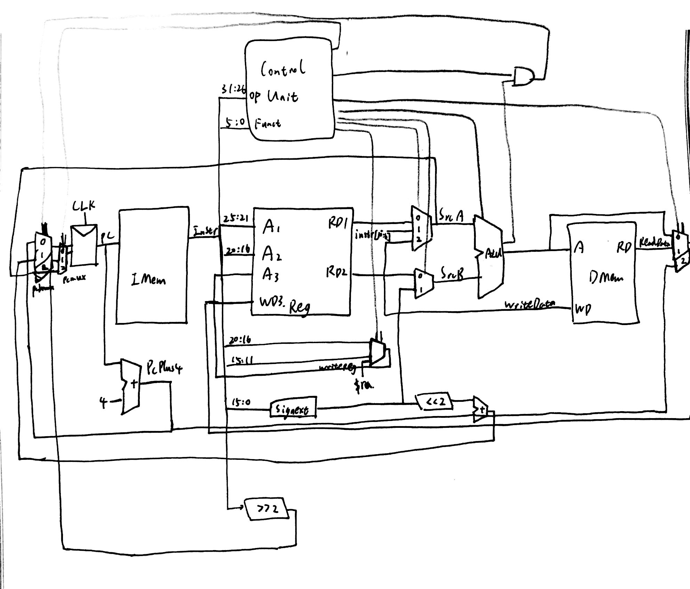

4.2 flopr（程序计数器）
-----------------------

//在时钟上升沿改变pc的值

module flopr \#(parameter WIDTH = 8)

(input clk, reset,

input [WIDTH-1:0] d,

output reg [WIDTH-1:0] q);

always \@(posedge clk, posedge reset)

if(reset) q\<=0;

else q\<=d;

endmodule

4.3 regfile（寄存器）设计
-------------------------

//时钟上升沿下降沿，且写信号为1时 写寄存器

module regfile(input clk,

input we3,

input [4:0] ra1,ra2,wa3,

input [31:0] wd3,

output [31:0] rd1, rd2);

reg [31:0] rf[31:0];

always\@(posedge clk)

if(we3)

begin

rf[wa3] \<= wd3;

\$display("R%d = %h", wa3, wd3);

end

assign rd1 = (ra1 != 0) ? rf[ra1] : 0;

assign rd2 = (ra2 != 0) ? rf[ra2] : 0;

endmodule

4.4 ALU（算术逻辑运算单元）
---------------------------

//实现了有符号加、有符号减、与、或、异或、有符号小于则置位、左移、右移、立即数置高位、无符号加、无符号减、无符号小于则置位。

//有符号的运算，由于计算机内为补码储存，检测溢出

module alu(input [31:0] a, input [31:0] b, input [3:0] alucontrol, output [31:0]
aluout, output zero);

reg [31:0] result;

//alucontrol:010 ADD; 110 Subtract; 000 AND; 001 OR; 101 XOR; 100 XAND; 111 SLT

always\@(\*)

begin

case(alucontrol)

4'b010: begin

result=a+b; //add

if(result[31] != a[31] && result[31] != b[31])

\$stop; //overflow

end

4'b110: begin

result=a-b; //sub

if((a[31] != b[31] && result[31] == b[31])\|\|(a != b && result == 0))

\$stop; //overflow

end

4'b000: result=a\&b; //and

4'b001: result=a\|b; //or

4'b101: result=a\|\~b; //xor

4'b111: case({a[31], b[31]}) //slt

2'b00: result=(a\<b)?1:0; //++

2'b01: result=0; //+-

2'b10: result=1; //-+

2'b11: result=(a\>b)?1:0; //--

endcase

//other code

4'b1000: result = b \<\< a; //sll

4'b1010: result = b \>\> a; //srl

4'b1001: result = {b[15:0], 16'b0}; //lui

4'b1011: result=a+b; //addu

4'b1100: result=a-b; //subu

4'b1101: result=(a\<b)?1:0; //sltu

endcase

end

assign zero = (result == 0)? 1 : 0;

assign aluout = result;

endmodule

4.5 signext（扩展单元）
-----------------------

//根据不同的信号，对立即数进行不同的扩展：符号扩展，0扩展，1扩展

module signext(input [15:0] a, input [1:0] signextsignal, output [31:0] y);

//addi : - 1

// + 0

//ori : 0

//andi : 1

reg [31:0] r;

always\@(\*)

case(signextsignal)

2'b00: r = {{16{a[15]}},a};

2'b10: r = {16'b0, a};

2'b11: r = {16'b1111111111111111, a};

default : r = {{16{a[15]}},a};

endcase

assign y = r;

endmodule

4.6 DMEM（数据存储器）
----------------------

module dmem (input clk, we,

input [31:0] a, wd,

output [31:0] rd);

reg [31:0] RAM[63:0];

assign rd = RAM[a[31:2]]; // word aligned

always \@(posedge clk)

if(we)

RAM[a[31:2]] \<= wd;

endmodule

4.7 IMEM（指令存储器）
----------------------

module imem (input [5:0] a, output [31:0] rd);

reg[31:0] RAM[63:0];

initial

begin

//\$readmemh ("memfile.dat", RAM);

//\$readmemh ("jaltest.dat", RAM);

//\$readmemh("sltaddsubtest.dat", RAM);

\$readmemh("mipstest_ext.dat", RAM);

end

assign rd = RAM[a]; // word aligned

endmodule

4.8 controller（控制器）
------------------------

//对于不同的指令产生不同的控制信号

module aludec(input [5:0] funct, op,

input [1:0] aluop,

output reg [3:0] alucontrol);

always \@(\*)

case (aluop)

2'b00: alucontrol \<= 4'b010; //add

2'b01: alucontrol \<= 4'b110; //sub

default: case(op)

6'b001111: alucontrol \<= 4'b1001; //LUI

6'b001010: alucontrol \<= 4'b0111; //SLTI

6'b001101: alucontrol \<= 4'b0001; //ORI

6'b001100: alucontrol \<= 4'b0000; //ANDI

default: case(funct)

6'b100000: alucontrol \<= 4'b010; //ADD

6'b100010: alucontrol \<= 4'b110; //SUB

6'b100100: alucontrol \<= 4'b000; //AND

6'b100101: alucontrol \<= 4'b001; //OR

6'b101010: alucontrol \<= 4'b111; //SLT

6'b100001: alucontrol \<= 4'b1011; //ADDU

6'b100011: alucontrol \<= 4'b1100; //SUBU

6'b101011: alucontrol \<= 4'b1101; //SLTU

//other code

6'b000000: alucontrol \<= 4'b1000; //SLL

6'b000010: alucontrol \<= 4'b1010; //SRL

default: alucontrol \<= 4'bxxx; //???

endcase

endcase

endcase

endmodule

module maindec(input [5:0] op, funct,

output toregaddition, memtoreg, memwrite,

output branch,

output [1:0] alusrca,

output alusrcb,

output wrdst, regdst, regwrite,

output jadition, jump,

output [1:0] aluop,

output bne,

output [1:0] signextsignal);

reg [10:0] controls;

assign {regwrite, regdst, alusrca, alusrcb, branch, memwrite, memtoreg, jump,
aluop} = controls;

always \@(\*)

case(op)

6'b000000:

case(funct)

6'b000000: controls \<= 11'b11010000011; //SLL

6'b000010: controls \<= 11'b11010000011; //SRL

6'b001000: controls \<= 11'b00000000000; //Jr

6'b001001: controls \<= 11'b11000000000; //Jalr

default: controls \<= 11'b11000000011; //Rtyp

endcase

6'b100011: controls \<= 11'b10001001000; //LW

6'b101011: controls \<= 11'b00001010000; //SW

6'b000100: controls \<= 11'b00000100001; //BEQ

6'b000101: controls \<= 11'b00000100001; //BNE

6'b001000: controls \<= 11'b10001000000; //ADDI

6'b001101: controls \<= 11'b10001000011; //ORI

6'b001100: controls \<= 11'b10001000011; //ANDI

6'b001111: controls \<= 11'b10101000011; //LUI

6'b001010: controls \<= 11'b10001000011; //SLTI

6'b000010: controls \<= 11'b00000000100; //J

6'b000011: controls \<= 11'b10000000100; //Jar

default: controls \<= 11'bxxxxxxxxxxx; //???

endcase

assign bne = (op == 6'b000101) ? 1 : 0; //BNE

assign jadition = ((op == 6'b000000 && funct == 6'b001000)\|\|(op == 6'b000000
&& funct == 6'b001001)) ? 1 : 0; //Jr Jalr

assign wrdst = (op == 6'b000011) ? 1 : 0; //Jal

assign toregaddition = ((op == 6'b000011)\|\|(op == 6'b000000 && funct ==
6'b001001)) ? 1 : 0; //Jal Jalr

assign signextsignal = (op == 6'b001100)?2'b11:((op == 6'b001101)?2'b10:2'b00);
//andi ori other

endmodule

module controller( input [5:0] op, funct,

input zero,

output toregaddition, memtoreg, memwrite,

output pcsrc,

output [1:0] alusrca,

output alusrcb,

output wrdst, regdst, regwrite,

output jadition, jump,

output [3:0] alucontrol,

output [1:0] signextsignal);

wire [1:0] aluop;

wire branch, bne;

maindec md(op, funct, toregaddition, memtoreg, memwrite, branch, alusrca,
alusrcb, wrdst, regdst, regwrite, jadition, jump, aluop, bne, signextsignal);

aludec ad(funct, op, aluop, alucontrol);

assign pcsrc = (\~bne & branch & zero) \| (bne & branch & \~zero);

endmodule

4.9 MIPS（模型机）
------------------

//将数据通路与控制模块连接起来

\`include"datapath.v"

\`include"controller.v"

module mips(input clk, reset,

output [31:0] pc,

input [31:0] instr,

output memwrite,

output [31:0] aluout, writedata,

input [31:0] readdata);

wire toregaddition, memtoreg, branch, alusrcb, wrdst, regdst, regwrite,
jadition, jump, pcsrc;

wire [1:0] alusrca, signextsignal;

wire [3:0] alucontrol;

controller c(instr[31:26], instr[5:0], zero, toregaddition, memtoreg, memwrite,
pcsrc, alusrca, alusrcb, wrdst, regdst, regwrite, jadition, jump, alucontrol,
signextsignal);

datapath dp(clk, reset, toregaddition, memtoreg, pcsrc, alusrca, alusrcb, wrdst,
regdst, regwrite, jadition, jump, alucontrol, zero, pc, instr, aluout,
writedata, readdata, signextsignal);

endmodule

5.流水线详细设计
================

5.1CPU总体结构
--------------

流水线的CPU总体结构如下图所示，其中包括程序计数器（flopr)、指令存储器（IMEM）、寄存器组（regfile）、运算器（ALU）、数据扩展单元（signext）、数据存储器（DMEM）和控制器（ControlUnit）、流水线顶层模块（Pipelinetop）、测试模块（testbench）、流水线IF模块（IF）、流水线IF/ID寄存器模块（IFIDreg）、流水线ID模块（ID）、流水线ID/EXE寄存器模块（IDEXEreg）、流水线EXE模块（EXE）、流水线EXE/MEM寄存器模块（EXEMEMreg）、流水线MEM模块（MEM）、流水线MEM/WB寄存器模块（MEMWBreg）、流水线WB模块（WB）。

在下图1中做了部分改动，在图2中进行说明。

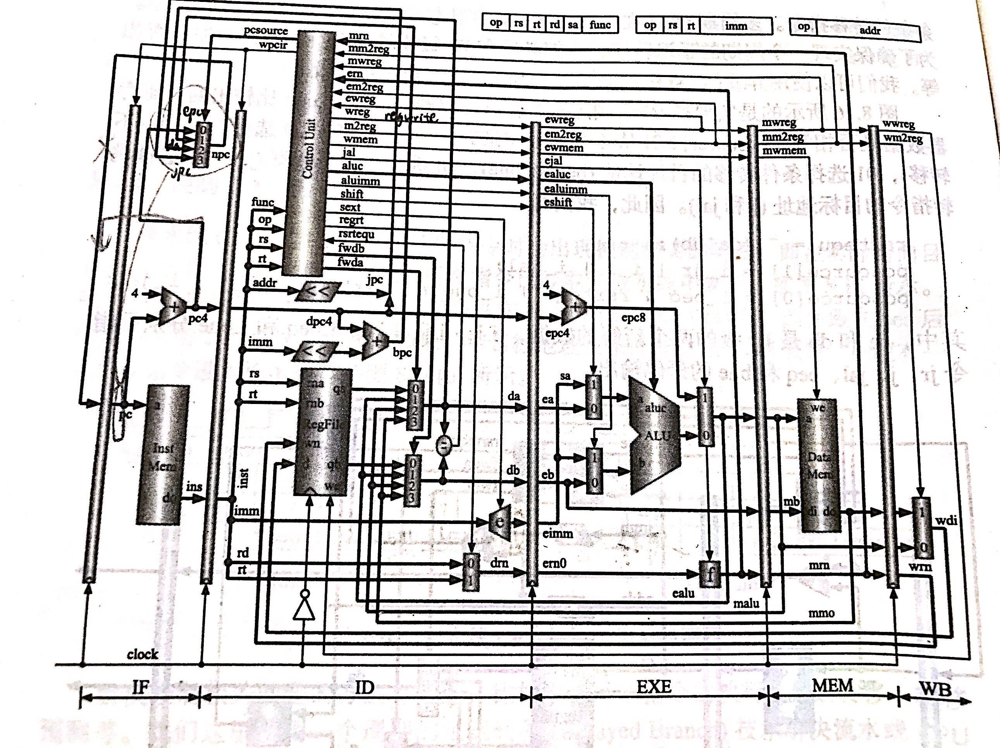

1.  去掉了EXE级的pc+8加法器，将dpc4与epc8信号直接相连

2.  在EXE级的ern0的二选一处增加了一个输入\$ra（即31号寄存器），所用信号与上方alu输出选择信号相同

3.  在ID级符号扩展后加入了一个二选一，输入为原符号结果eimm和instr指令中sllsrl所需要的立即数部分

4.  IF级pc输入段直接变为pc4，而将原来输入pc的四选一移至pc的输出端，控制信号不变，输入信号由pc4、bpc、da、jpc变为pc、bpc、da、jpc，输出信号被送至imem和pc+4加法器。

>   通过1和4，将这个CPU设计成了无延迟时间槽的CPU，虽在实际应用上存在缺陷，但使得在仿真中指令的执行更为直观。

5.2 flopr（程序计数器）
-----------------------

//时钟上升沿更改pc的值，但wpcir为1时，不改变pc值

module flopr \#(parameter WIDTH = 8)

(input clk, reset, wpcir,

input [WIDTH-1:0] d,

output reg [WIDTH-1:0] q);

always \@(posedge clk, posedge reset)

if(reset) q\<=0;

else if(\~wpcir) q\<=d;

endmodule

5.3 regfile（寄存器）
---------------------

//时钟上升沿下降沿，且写信号为1时 写寄存器

module regfile(input clk,

input we3,

input [4:0] ra1,ra2,wa3,

input [31:0] wd3,

output [31:0] rd1, rd2);

reg [31:0] rf[31:0];

always\@(clk)

if(we3)

begin

rf[wa3] \<= wd3;

\$display("R%d = %h", wa3, wd3);

end

assign rd1 = (ra1 != 0) ? rf[ra1] : 0;

assign rd2 = (ra2 != 0) ? rf[ra2] : 0;

endmodule

5.4 ALU（算数逻辑运算单元）
---------------------------

//实现了有符号加、有符号减、与、或、异或、有符号小于则置位、左移、右移、立即数置高位、无符号加、无符号减、无符号小于则置位。

//有符号的运算，由于计算机内为补码储存，检测溢出

module alu(input [31:0] a, input [31:0] b, input [3:0] alucontrol, output [31:0]
aluout, output zero);

reg [31:0] result;

//alucontrol:010 ADD; 110 Subtract; 000 AND; 001 OR; 101 XOR; 100 XAND; 111 SLT

always\@(\*)

begin

case(alucontrol)

4'b010: begin

result=a+b; //add

if(result[31] != a[31] && result[31] != b[31])

\$stop; //overflow

end

4'b110: begin

result=a-b; //sub

if((a[31] != b[31] && result[31] == b[31])\|\|(a != b && result == 0))

\$stop; //overflow

end

4'b000: result=a\&b; //and

4'b001: result=a\|b; //or

4'b101: result=a\|\~b; //xor

4'b111: case({a[31], b[31]}) //slt

2'b00: result=(a\<b)?1:0; //++

2'b01: result=0; //+-

2'b10: result=1; //-+

2'b11: result=(a\>b)?1:0; //--

endcase

//other code

4'b1000: result = b \<\< a; //sll

4'b1010: result = b \>\> a; //srl

4'b1001: result = {b[15:0], 16'b0}; //lui

4'b1011: result=a+b; //addu

4'b1100: result=a-b; //subu

4'b1101: result=(a\<b)?1:0; //sltu

endcase

end

assign zero = (result == 0)? 1 : 0;

assign aluout = result;

endmodule

5.5 signext（扩展单元）
-----------------------

//根据不同的信号，对立即数进行不同的扩展：符号扩展，0扩展，1扩展

module signext(input [15:0] a, input [1:0] signextsignal, output [31:0] y);

//addi : - 1

// + 0

//ori : 0

//andi : 1

reg [31:0] r;

always\@(\*)

case(signextsignal)

2'b00: r = {{16{a[15]}},a};

2'b10: r = {16'b0, a};

2'b11: r = {16'b1111111111111111, a};

default : r = {{16{a[15]}},a};

endcase

assign y = r;

endmodule

5.6 dmem（数据储存器）
----------------------

//在时钟上升沿写数据，32\*64位大小

module dmem (input clk, we,

input [31:0] a, wd,

output [31:0] rd);

reg [31:0] RAM[63:0];

assign rd = RAM[a[31:2]]; // word aligned

always \@(posedge clk)

if(we)

RAM[a[31:2]] \<= wd;

endmodule

5.7 imem（指令寄存器）
----------------------

//打开指令 .dat文件

module imem (input [5:0] a, output [31:0] rd);

reg[31:0] RAM[63:0];

initial

begin

//\$readmemh ("memfile.dat", RAM);

//\$readmemh ("jaltest.dat", RAM);

//\$readmemh("sltaddsubtest.dat", RAM);

//\$readmemh("mipstest_ext.dat", RAM);

//\$readmemh("Test_Single_Pipelined.dat", RAM);

\$readmemh("mipstest_pipelined.dat", RAM);

end

assign rd = RAM[a]; // word aligned

endmodule

5.8 ControlUnit（控制器）
-------------------------

//对于不同的指令产生不同的控制信号，并解决流水线数据冒险与控制冒险

module aludec(input [5:0] funct, op,

input [1:0] aluop,

output reg [3:0] alucontrol);

always \@(\*)

case (aluop)

2'b00: alucontrol \<= 4'b010; //add

2'b01: alucontrol \<= 4'b110; //sub

default: case(op)

6'b001111: alucontrol \<= 4'b1001; //LUI

6'b001010: alucontrol \<= 4'b0111; //SLTI

6'b001101: alucontrol \<= 4'b0001; //ORI

6'b001100: alucontrol \<= 4'b0000; //ANDI

default: case(funct)

6'b100000: alucontrol \<= 4'b010; //ADD

6'b100010: alucontrol \<= 4'b110; //SUB

6'b100100: alucontrol \<= 4'b000; //AND

6'b100101: alucontrol \<= 4'b001; //OR

6'b101010: alucontrol \<= 4'b111; //SLT

6'b100001: alucontrol \<= 4'b1011; //ADDU

6'b100011: alucontrol \<= 4'b1100; //SUBU

6'b101011: alucontrol \<= 4'b1101; //SLTU

//other code

6'b000000: alucontrol \<= 4'b1000; //SLL

6'b000010: alucontrol \<= 4'b1010; //SRL

default: alucontrol \<= 4'bxxx; //???

endcase

endcase

endcase

endmodule

module maindec(input [5:0] op, funct,

output wreg, m2reg, wmem, jal, jrjalr, aluimm, shift, signextsignal, regrt,
jump, beq, bne, sllsrl,

output i_rs, i_rt,

output [1:0] aluop);

reg [10:0] controls;

assign {wreg, regrt, shift, aluimm, wmem, m2reg, jump, aluop, i_rs, i_rt} =
controls;

//assign {regwrite, regdst, alusrca, alusrcb, branch, memwrite, memtoreg, jump,
aluop} = controls;

assign jal = ((op == 6'b000011)\|\|(op == 6'b000000 && funct == 6'b001001)) ? 1
: 0; //Jr Jalr

assign jrjalr = ((op == 6'b000000 && funct == 6'b001000)\|\|(op == 6'b000000 &&
funct == 6'b001001)) ? 1 : 0; //Jr Jalr

assign signextsignal = (op == 6'b001100)?2'b11:((op == 6'b001101)?2'b10:2'b00);
//andi ori other

always \@(\*)

case(op)

6'b000000:

case(funct)

6'b000000: controls = 11'b11100001101; //SLL

6'b000010: controls = 11'b11100001101; //SRL

6'b001000: controls = 11'b00000010010; //Jr

6'b001001: controls = 11'b11000010010; //Jalr

default: controls = 11'b11000001111; //Rtyp

endcase

6'b100011: controls = 11'b10010100001; //LW

6'b101011: controls = 11'b00011000001; //SW

6'b000100: controls = 11'b00000000111; //BEQ

6'b000101: controls = 11'b00000000111; //BNE

6'b001000: controls = 11'b10010000011; //ADDI

6'b001101: controls = 11'b10010001111; //ORI

6'b001100: controls = 11'b10010001111; //ANDI

6'b001111: controls = 11'b10010001101; //LUI

6'b001010: controls = 11'b10010001111; //SLTI

6'b000010: controls = 11'b00000010000; //J

6'b000011: controls = 11'b10000010010; //Jar

default: controls = 11'bxxxxxxxxxxx; //???

endcase

assign beq = (op == 6'b000100) ? 1 : 0; //BEQ

assign bne = (op == 6'b000101) ? 1 : 0; //BNE

assign sllsrl = (op == 6'b000000) && ((funct == 6'b000000) \|\| (funct ==
6'b000010)) ? 1 : 0; //SLL SRL

/\*

assign jadition = ((op == 6'b000000 && funct == 6'b001000)\|\|(op == 6'b000000
&& funct == 6'b001001)) ? 1 : 0; //Jr Jalr

assign wrdst = (op == 6'b000011) ? 1 : 0; //Jal

assign toregaddition = ((op == 6'b000011)\|\|(op == 6'b000000 && funct ==
6'b001001)) ? 1 : 0; //Jal Jalr

assign signextsignal = (op == 6'b001100)?2'b11:((op == 6'b001101)?2'b10:2'b00);
//andi ori other

\*/

endmodule

module ControlUnit( input [5:0] op, funct,

input [4:0] ern, mrn, rs, rt,

input [4:0] ewreg, mwreg, em2reg, mm2reg,

output wreg, m2reg, wmem, jal,

output [3:0] alucontrol,

output aluimm, shift,

output wpcir,

output [1:0] pcsource,

output signextsignal, regrt,

input rsrtequ,

output sllsrl,

output [1:0] fwda, fwdb);

wire [1:0] aluop;

wire jump, beq, bne, b;

wire i_rs, i_rt;

wire wregorg, wmemorg, stall;

maindec md(op, funct,

wregorg, m2reg, wmemorg, jal, jrjalr,

aluimm, shift,

signextsignal, regrt,

jump, beq, bne,

sllsrl,

i_rs, i_rt,

aluop);

aludec ad(funct, op, aluop, alucontrol);

assign b = (beq & rsrtequ) \| (bne & \~rsrtequ);

assign pcsource = \~(jump \| jrjalr) ? ( \~(b) ? 2'b00 : 2'b01) : (jrjalr ?
2'b10 : 2'b11);

reg [1:0] dam, dbm;

always \@ (ewreg, mwreg, ern, mrn, em2reg, mm2reg, rs, rt) begin

dam = 2'b00;

if(ewreg &(ern != 0) & (ern == rs) & \~em2reg) begin

dam = 2'b01;

end else begin

if(mwreg & (mrn != 0) & (mrn == rs) && \~mm2reg) begin

dam = 2'b10;

end else begin

if(mwreg & (mrn != 0) & (mrn == rs) & mm2reg) begin

dam = 2'b11;

end

end

end

dbm = 2'b00;

if(ewreg &(ern != 0) & (ern == rt) & \~em2reg) begin

dbm = 2'b01;

end else begin

if(mwreg & (mrn != 0) & (mrn == rt) && \~mm2reg) begin

dbm = 2'b10;

end else begin

if(mwreg & (mrn != 0) & (mrn == rt) & mm2reg) begin

dbm = 2'b11;

end

end

end

end

assign fwda = dam;

assign fwdb = dbm;

assign wpcir = ewreg & em2reg & (ern != 0) &(i_rs & (ern == rs) \| i_rt & (ern
== rt));

//assign wpcir = \~stall;

assign wreg = wregorg & \~wpcir;

assign wmem = wmemorg & \~wpcir;

endmodule

5.9 Pipelinetop（流水线顶层文件）
---------------------------------

//流水线顶层文件，将流水线5个模块与寄存器连接起来

\`include"pipeline.v"

module pipelinetop( input clk, reset);

//IF

wire [31:0] instr, pcplus4;

wire [31:0] instrD, pcplus4D;

//ID

wire wreg, m2reg, wmem, jal;

wire [3:0] alucontrol;

wire aluimm, shift;

wire wpcir;

wire [1:0] pcsource;

wire [31:0] bpc, jpc;

wire [31:0] dpc4, da, db, dimm;

wire [4:0] drn;

wire ewreg, em2reg, ewmem, ejal;

wire [3:0] alucontrolE;

wire ealuimm, eshift;

wire [31:0] ea, eb, SignimmE, epc4, instrE;

wire [4:0] WriteRegE;

//EXE

wire [31:0] ealu;

wire mwreg, mm2reg, mwmem;

wire [31:0] malu, mb;

wire [4:0] mrn, ern;

//MEM

wire [31:0] mdo;

wire wwreg, wm2reg;

wire [31:0] walu, wdo;

wire [4:0] wrn;

//WB

wire [31:0] wdi;

IF IF(clk, reset, bpc, da, jpc, pcsource, wpcir, instr, pcplus4);

IFIDreg IFIDreg(clk, reset, wpcir, instr, pcplus4, instrD, pcplus4D);

ID ID( clk,

instrD, pcplus4D,

mrn, mm2reg, mwreg, ern, em2reg, ewreg,

wreg, m2reg, wmem, jal, alucontrol, aluimm, shift, wpcir, pcsource,

bpc, jpc,

ealu, malu, mdo,

wwreg, wrn, wdi,

da, db, dimm, drn);

IDEXEreg IDEXEreg( clk, reset,

wreg, m2reg, wmem, jal, alucontrol, aluimm, shift,

ewreg, em2reg, ewmem, ejal, alucontrolE, ealuimm,eshift,

da, db, dimm, pcplus4D, instrD, drn,

ea, eb, SignimmE, epc4, instrE, WriteRegE);

EXE EXE( ea, eb, SignimmE, epc4, WriteRegE,

ejal, alucontrolE, ealuimm, eshift, ealu, ern);

EXEMEMreg EXEMEMreg( clk, reset,

ewreg, em2reg, ewmem,

mwreg, mm2reg, mwmem,

ealu, eb, ern,

malu, mb, mrn);

MEM MEM(clk, mwmem, malu, mb, mdo);

MEMWBreg MEMWBreg(clk, reset,

mwreg, mm2reg,

wwreg, wm2reg,

malu, mdo, mrn,

walu, wdo, wrn);

WB WB(walu, wdo, wm2reg, wdi);

endmodule

5.10 testbench（测试模块）
--------------------------

//产生时钟信号与复位信号

\`timescale 1ps/1ps

//\`include "top.v"

\`include"pipelinetop.v"

module \_testbench();

reg clk;

reg reset;

wire [31:0] writedata, dataadr;

wire memwrite;

// instantiate device to be tested

//top dut (clk, reset, writedata, dataadr, memwrite);

pipelinetop pipelinetop(clk, reset);

// initialize test

initial

begin

reset \<= 1; \# 22; reset \<= 0;

end

// generate clock to sequence tests

always

begin

clk \<= 1; \# 5; clk \<= 0; \# 5;

end

endmodule

5.11 IF（流水线IF模块）
-----------------------

module IF( input clk, reset,

input [31:0] bpc, da, jpc,

input [1:0] pcsource,

input wpcir,

output [31:0] instr, pcplus4);

wire [31:0] pc, pcnext;

wire [31:0] pcold;

wire s;

//reset pc signal

flopr \#(32) pcreg(clk, reset, wpcir, pcnext, pcold);

//pcplus4 = pc + 4

adder pcadd1(pc, 32'b100, pcplus4);

//Fetch Instruction

imem imem (pc[7:2], instr);

/\*

//4-\>1

mux4 \#(32) pcmux(pcplus4, bpc, da, jpc, pcsource, pcnext);

//mux2 for update pcvalue

assign s = pcsource == 0 ? 0 : 1;

mux2 \#(32) newpcmux(pcold, pcnext, s, pc);

\*/

mux4 \#(32) pcchose(pcold, bpc, da, jpc, pcsource, pc);

adder pcadd2(pc, 32'b100, pcnext);

endmodule

5.12 IFIDreg（流水线IF/ID流水线寄存器模块）
-------------------------------------------

module IFIDreg( input clk, reset, wpcir,

input [31:0] instrF, pcplus4F,

output [31:0] instrD, pcplus4D);

reg [31:0] instr, pcplus4;

//write

always\@(posedge clk or posedge reset)

begin

if(reset == 1)

begin

instr \<= 0;

pcplus4 \<= 0;

end

else if(\~wpcir)

begin

instr \<= instrF;

pcplus4 \<= pcplus4F;

end

end

//read

assign instrD = instr;

assign pcplus4D = pcplus4;

endmodule

5.13 ID（流水线ID模块）
-----------------------

module ID( input clk,

//from IFIDreg

input [31:0] instr, dpc4,

//input signal

input [4:0] mrn,

input mm2reg, mwreg,

input [4:0] ern,

input em2reg, ewreg,

//output control signal

output wreg, m2reg, wmem, jal,

output [3:0] alucontrol,

output aluimm, shift,

output wpcir,

output [1:0] pcsource,

//control signal end

//to IF

output [31:0] bpc, jpc,

//data conflict

input [31:0] ealu, malu, mmo,

//write regfile

input regwriteW, // from WB

input [4:0] writeregW, // from WB

input [31:0] result,

//to IDEXEreg

output [31:0] da, db, dimm,

output [4:0] drn);

wire signextsignal, regrt;

wire rsrtequ;

wire [1:0] fwda, fwdb;

wire [31:0] rd1, rd2;

wire sllsrl;

wire [31:0] dimmold;

//

ControlUnit Controller (instr[31:26], instr[5:0],

ern, mrn, instr[25:21], instr[20:16], ewreg, mwreg, em2reg, mm2reg,

wreg, m2reg, wmem, jal, alucontrol, aluimm, shift, wpcir, pcsource,

signextsignal,regrt, rsrtequ, sllsrl,

fwda, fwdb);

//jpc

assign jpc = {dpc4[31:28], instr[25:0], 2'b00};

//shift left

assign bpc = dpc4 + {{4'b0}, instr[15:0], 2'b00};

regfile rf(clk,regwriteW, instr[25:21], instr[20:16], writeregW, result, rd1,
rd2);

//da db mux

mux4 \#(32) damux(rd1, ealu, malu, mmo, fwda, da);

mux4 \#(32) dbmux(rd2, ealu, malu, mmo, fwdb, db);

assign rsrtequ = \~\|(da\^db);

//write reg number

mux2 \#(5) wrmux(instr[20:16], instr[15:11], regrt, drn);

//sign extend

signext se(instr[15:0], signextsignal, dimmold);

mux2 \#(32) sllmux(dimmold, {27'b0, instr[10:6]}, sllsrl, dimm);

endmodule

5.14 IDEXEreg（流水线ID/EXE流水线寄存器模块）
---------------------------------------------

module IDEXEreg( input clk, reset,

//input control signal

input wreg, m2reg, wmem, jal,

input [3:0] alucontrolD,

input aluimm, shift,

//input control signal end

//output control signal

output ewreg, em2reg, ewmem, ejal,

output [3:0] alucontrolE,

output ealuimm, eshift,

//output control signal end

input [31:0] da, db, SignimmD, dpc, instrD,

input [4:0] WriteRegD,

output [31:0] ea, eb, SignimmE, epc4, instrE,

output [4:0] WriteRegE

);

reg [9:0] signals;

reg [31:0] RD1, RD2, Signimm, pcplus4, instr;

reg [4:0] WriteReg;

//write

always\@(posedge clk or posedge reset)

begin

if(reset == 1)

begin

signals \<= 0;

RD1 \<= 0;

RD2 \<= 0;

WriteReg \<= 0;

Signimm \<= 0;

pcplus4 \<= 0;

end

else

begin

signals \<= {wreg, m2reg, wmem, jal, alucontrolD, aluimm, shift};

RD1 \<= da;

RD2 \<= db;

WriteReg \<= WriteRegD;

Signimm \<= SignimmD;

pcplus4 \<= dpc;

instr \<= instrD;

end

end

//read

assign {ewreg, em2reg, ewmem, ejal, alucontrolE, ealuimm, eshift} = signals;

assign ea = RD1;

assign eb = RD2;

assign WriteRegE = WriteReg;

assign SignimmE = Signimm;

assign epc4 = pcplus4;

assign instrE = instr;

endmodule

5.15 EXE（流水线EXE模块）
-------------------------

module EXE( input [31:0] ea, eb, eimm,

input [31:0] epc4,

input [4:0] ern0,

//signal

input ejal,

input [3:0] alucontrol,

input ealuimm, eshift,

//signal end

output [31:0] ealu,

output [4:0] ern);

wire [31:0] srcb, srca, aluout;

wire zero;

//ea eb

mux2 \#(32) eamux(ea, eimm, eshift, srca);

mux2 \#(32) ebmux(eb, eimm, ealuimm, srcb);

alu alu(srca, srcb, alucontrol, aluout, zero);

//alu mux

//mux2 \#(32) elaumux(aluout, epc4 + 4, ejal, ealu);

mux2 \#(32) elaumux(aluout, epc4, ejal, ealu);

assign ern = ejal ? 5'b11111 : ern0;

endmodule

5.16 EXEMEMreg（流水线EXE/MEM流水线寄存器模块）
-----------------------------------------------

module EXEMEMreg( input clk, reset,

//input control signal

input ewreg, em2reg, ewmem,

//input control signal end

//output control signal

output mwreg, mm2reg, mwmem,

//output control signal end

input [31:0] ealu, eb,

input [4:0] ern,

output [31:0] malu, mb,

output [4:0] mrn

);

reg [2:0] signals;

reg [31:0] alu, b;

reg [4:0] rn;

//write

always\@(posedge clk or posedge reset)

begin

if(reset == 1)

begin

signals \<= 0;

alu \<= 0;

b \<= 0;

rn \<= 0;

end

else

begin

signals \<= {ewreg, em2reg, ewmem};

alu \<= ealu;

b \<= eb;

rn \<= ern;

end

end

//read

assign {mwreg, mm2reg, mwmem} = signals;

assign malu = alu;

assign mb = b;

assign mrn = rn;

endmodule

5.17 MEM（流水线MEM模块） 
--------------------------

module MEM( input clk,

//signal

input mwmem,

//signal end

input [31:0] malu, mb,

output [31:0] readdata);

dmem dmem(clk, mwmem, malu, mb, readdata);

endmodule

5.18 MEMWBreg（流水线MEM/WB流水线寄存器模块）
---------------------------------------------

module MEMWBreg( input clk, reset,

//signal

input mwreg, mm2reg,

output wwreg, wm2reg,

//signal end

input [31:0] malu, mdo,

input [4:0] mrn,

output [31:0] walu, wdo,

output [4:0] wrn);

reg [1:0] signals;

reg [31:0] alu, ddo;

reg [4:0] rn;

//write

always\@(posedge clk or posedge reset)

begin

if(reset == 1)

begin

signals \<= 0;

alu \<= 0;

ddo \<= 0;

rn \<= 0;

end

else

begin

signals \<= {mwreg, mm2reg};

alu \<= malu;

ddo \<= mdo;

rn \<= mrn;

end

end

//read

assign {wwreg, wm2reg} = signals;

assign walu = alu;

assign wdo = ddo;

assign wrn = rn;

endmodule

5.19 WB（流水线WB模块）
-----------------------

module WB( input [31:0] walu, mdo,

input wm2reg,

output [31:0] wdi);

//aluout / readdata /PC+4 -\> write reg

mux2 \#(32) resmux(walu, mdo, wm2reg, wdi);

endmodule

6.测试和结果分析
================

6.1测试文件 mipstest_pipelined.asm
----------------------------------

main: addi \$2, \$0, 5 \# initialize \$2 = 5 00 20020005

ori \$3, \$0, 12 \# initialize \$3 = 12 04 3403000c

subu \$1, \$3, \$2 \# \$1 = 12 - 5 = 7 08 00620823

srl \$7, \$1, 1 \# \$7 = 7 \>\> 1 = 3 0c 00013842

call_a: j a \# jump to a 10 08000015

or \$4, \$7, \$2 \# \$4 \<= 3 or 5 = 7 14 00e22025

and \$5, \$3, \$4 \# \$5 \<= 12 and 7 = 4 18 00642824

add \$5, \$5, \$4 \# \$5 = 4 + 7 = 11 1c 00a42820

beq \$5, \$7, end \# should not be taken 20 10a70018

sltu \$4, \$3, \$4 \# \$4 = 12 \< 7 = 0 24 0064202b

\#Test if there is control hazard

beq \$4, \$0, around \# should be taken 28 10800003

addi \$5, \$0, 0 \# should not happen 2c 20050000

addi \$5, \$0, 0 \# should not happen 30 20050000

addi \$5, \$0, 0 \# should not happen 34 20050000

around: slt \$4, \$7, \$2 \# \$4 = 3 \< 5 = 1 38 00e2202a

addu \$7, \$4, \$5 \# \$7 = 1 + 11 = 12 3c 00853821

sub \$7, \$7, \$2 \# \$7 = 12 - 5 = 7 40 00e23822

sw \$7, 68(\$3) \# [80] = 7 44 ac670044

lw \$2, 80(\$0) \# \$2 = [80] = 7 48 8c020050

j end \# should be taken 4c 08000021

addi \$2, \$0, 1 \# should not happen 50 20020001

a: sll \$7, \$7, 2 \# \$7 = 3 \<\< 2 = 12 54 00073880

call_b: jal b \# jump to b 58 0c000019

addi \$31,\$0,20 \# \$31 \<= 20 5c 201f0014

jr \$31 \# return to call_a 60 03e00008

b: lui \$1, 0xFFAA \# \$1 \<= 0xFFAA0000 64 3c01ffaa

slt \$1, \$7, \$1 \# \$1 \<= 0 66 00e1082a

bne \$1, \$0, end \# should not be taken 6c 14200005

sub \$7, \$7, \$2 \# \$7 = 12 - 5 = 7 70 00e23822

srl \$7, \$7, 1 \# \$7 = 7 \>\> 1 = 3 74 00073842

nor \$1, \$7, \$1 \# \$1 = 0xFFFFFFFC 78 00e10827

sltu \$1, \$1, \$7 \# \$1 \<= 0 7c 0027082b

jr \$31 \# return to call_b 80 03e00008

\# Test if there is M2M copy hazard

end: sw \$3, 84(\$0) \# [84] = 12 84 ac030054

lw \$7, 72(\$3) \# \$7 = [84] = 12 88 8c670048

sw \$7, 68(\$3) \# [80] = 12 8c ac670044

6.2测试机器码 mipstest_pipelined.asm
------------------------------------

20020005

3403000c

00620823

00013842

08000015

00e22025

00642824

00a42820

10a70018

0064202b

10800003

20050000

20050000

20050000

00e2202a

00853821

00e23822

ac670044

8c020050

08000021

20020001

00073880

0c000019

201f0014

03e00008

3c01ffaa

00e1082a

14200005

00e23822

00073842

00e10827

0027082b

03e00008

ac030054

8c670048

ac670044

6.3 测试结果分析（下面的指令均在流水线下运行）
----------------------------------------------

以下指令均在有旁路分支在ID级、没有延迟时间槽的流水线下执行，跳转相关指令均涉及控制相关，其他指令也大部分设计到数据相关。

### 6.3.1 ori \$1, \$1, 0x2211指令

在这条指令前\$1为0x10000000。这条指令是将1号寄存器中的值与十六进制数0x2211相或。运行过程如下图所示，pc值为8，机器码为3c021000为该指令，在该指令的ID级，我们可以看到，rs寄存器为1，读出的数据为0x10000000。在下一个周期，立即数0x2211经过扩展送到ALU的b端，与a端的0x10000000在ALU中进行或运算，在两个周期后的时钟下降沿，0x10002211成功被送回\$1寄存器。证明实现成功。

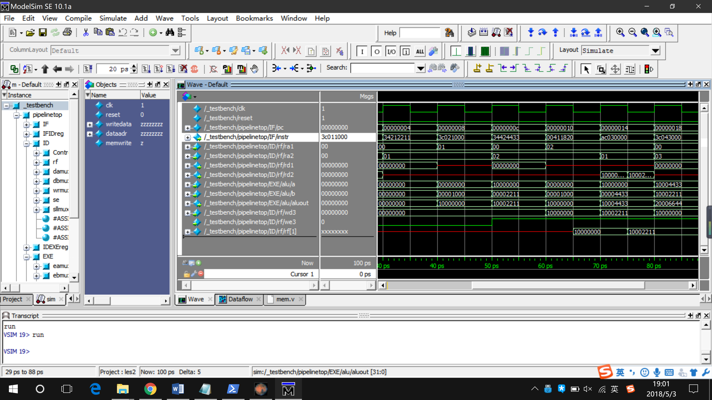

### 6.3.2 andi \$3, \$2, 0x2333指令

这条指令是将2号寄存器中的值与0x2333向与，并送回3号寄存器中。仿真结果如下所示。我们可以看到pc为0x10时，该指令30432333被取出。在下一个时钟周期，该指令进入ID级，值得一提的是，**这是一个数据冒险**，因为上一条指令是ori
\$2, \$2,
0x4433，2号寄存器的值还没被写回寄存器组，我们从寄存器中取出的值并不是\$2真正的值。但在我们通过旁路解决了数据冒险，将刚在EXE级运算得到的\$2马上送回到了ID级，我们可以在图中看到EXE级ALU的输入端为0x10004433，b端输入为0x00002333，运算结果为0x33。并在两个周期后写回到\$3中。可以证明我们这条指令执行成功。

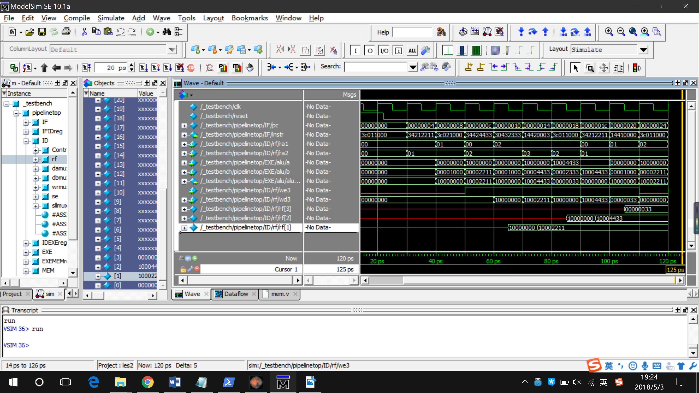

### 6.3.3 bne \$2, \$2, end指令

其实这也是一条控制冒险指令，因为是在已优化的流水线中运行，分支是在ID级进行的。这条指令是对比\$2与\$2中的值，若不相等则跳转。在下图中我们可以看到，pc为0x1c时，这条指令0x14420003被取出，在其ID级时，寄存器组输出rs，rd的值相等，pcsource仍未0，没有发生跳转，这条指令执行成功。

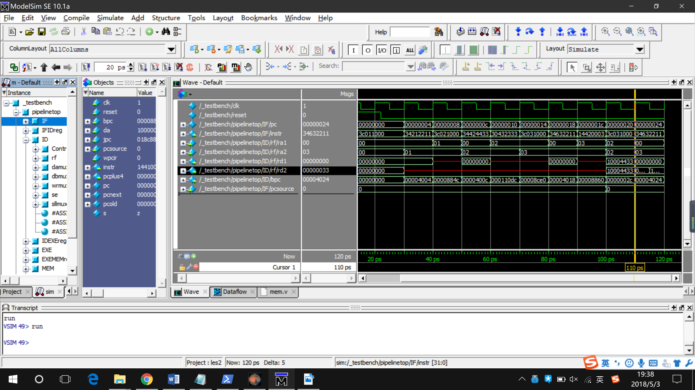

### 6.3.4 bne \$2, \$1, end指令

这也是控制冒险，为了验证，bne跳转时的正确性。对比\$1和\$2中的值，不相等则跳转，在这条指令前\$1为0x10002211，
\$2为0x10004433。如图所示，在pc为0x28的时候，该指令0x14410000被取出，处于IF级，在下一个周期，进入ID级，我们可以从图中看到，rs和rt取出的值不相同，pcsource变成了1，跳转到了pc0x3c。但由于我取消了执行延迟时间槽，在下一个周期pc就变成了0x3c。虽在实际设计cpu时不能这样设计，但在仿真中，这条指令也是执行成功的了。

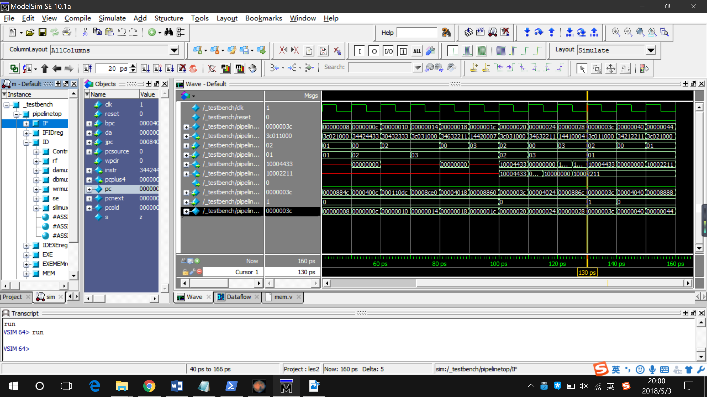

### 6.3.5 lui \$1, 0x1000指令

Lui指令是将16位数置在寄存器高位，并在低位补零。右下图所示，1号寄存器在50ps时被存入了0x10000000，证明该指令执行成功。

### 6.3.6 add \$3, \$1, \$1指令

在这条指令前\$1为0x0fffffff，在有符号加法中会产生溢出，我在代码中也做了判断，由图中可看到，alu输出了0x1ffffffe并暂停发出异常。说明这个CPU对于有符号的加减法有溢出检测的功能。

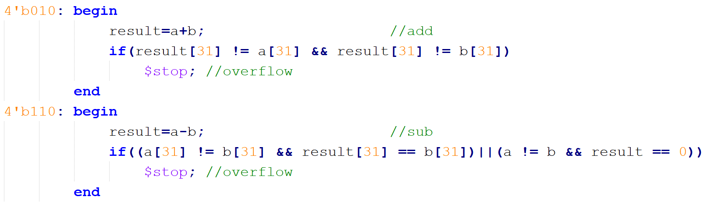

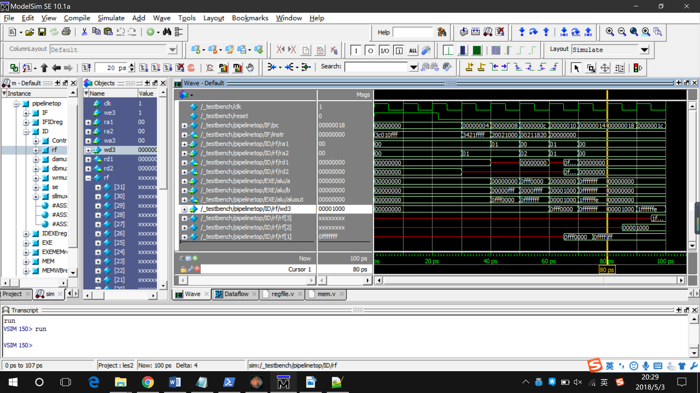

### 6.3.7 slt \$4, \$1, \$2指令

这条指令是有符号小于则置位，在这条指令前，\$1为0xFFFFFFFF，\$2为0x1000。在补码表示中\$1为-1，\$2为0x1000。显然\$1小于\$2，根据下图所示，ALU做出了正确的判断，将\$4置为1.说明有符号小于则置位执行成功。源代码如下图所示。

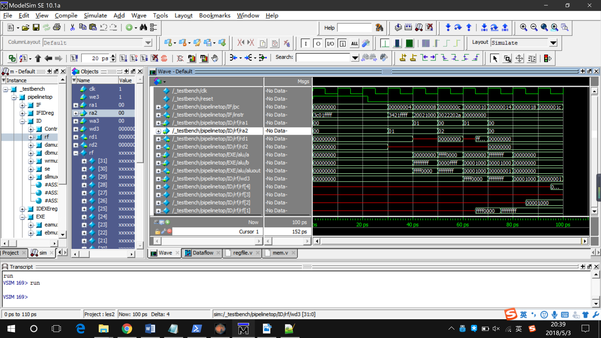

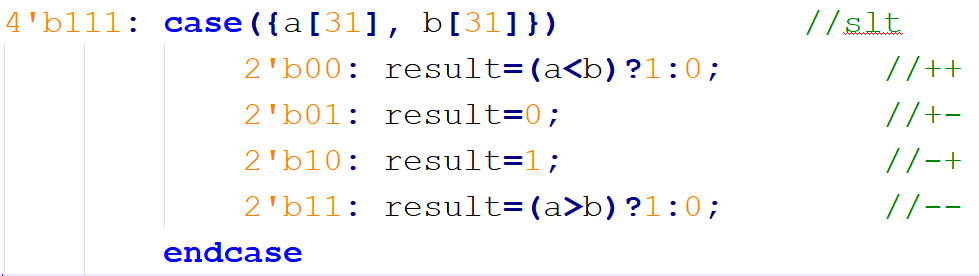

### 6.3.8 sltu \$4, \$1, \$2指令

这条指令是无符号小于则置位在这条指令前，\$1为0xFFFFFFFF，\$2为0x1000。因为是无符号数，显然\$2小于\$1。如下图所示，ALU输出结果为0，并\$4中被存入0，表明无符号小于则置位执行成功。

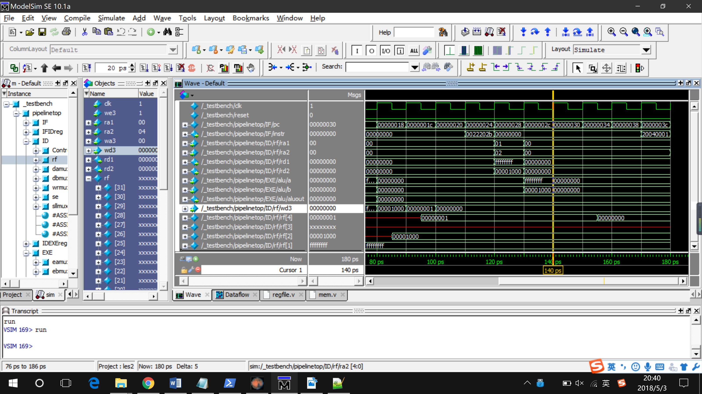

### 6.3.9 j a指令（控制冒险）

这是一条jump指令，将会跳转到a处，a的pc为0x54。如下图所示，当pc为10的时候，取出jump指令08000015，当下一个周期执行到ID级时，pcsource置3，选择来自jump的pc值，并修改pc到imem的信号并再次读取指令寄存器，（因为更改了电路，取消了延迟时间槽，但在实际设计中会带来额外的时钟周期的开销），在紧接着的一个时钟周期，pc就被切换到了a所在的0x54地址。所以说明jump指令执行成功。

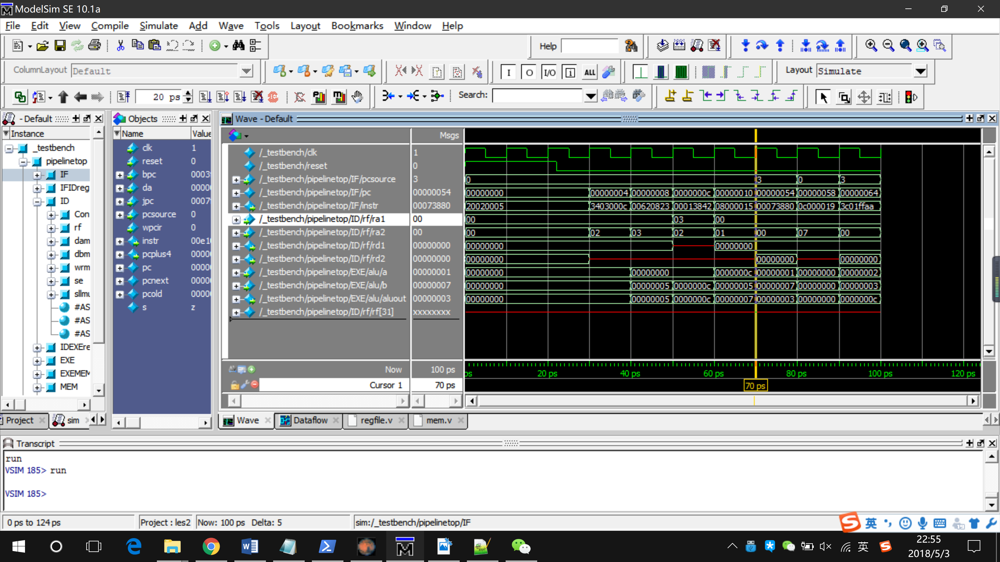

### 6.3.10 jal b指令(控制冒险)

这条指令将会跳转到b所在的地址0x64，并将pc+4存入\$31号寄存器中，仿真结果如下所示。可以看到，在pc为58时，取出jal指令0c000019，在下一个时钟周期pc更改为64（取消了延迟时间槽），并在其WB阶段，将pc+4写入31号寄存器中。（因为没有延迟时间槽，pc+4那条指令还没有执行，所以等到jr后在执行pc+4也没有问题）。Jal指令执行成功。

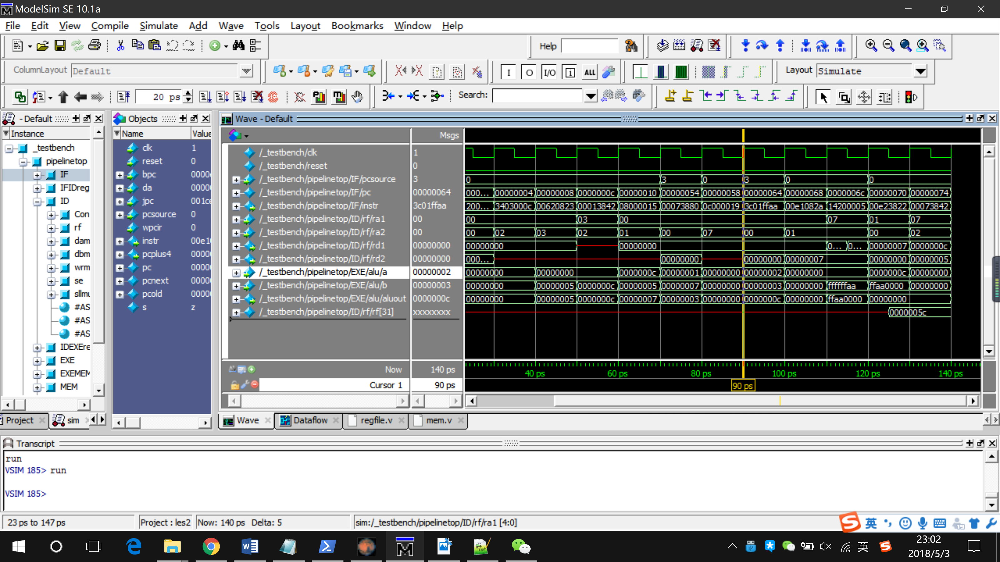

### 6.3.11 jr \$31指令

jr
\$31指令是将31号寄存器中的值置到pc。运行结果如下图所示，在pc为0x80的时候，读取到了jr指令0x03e00008。因为\$31不是rs也不是rt，所以不是通过rsrt从寄存器组读出。然后pcsource置2，读取来自寄存器的值，紧接着pc就更改为0x5c。说明jr指令执行成功。

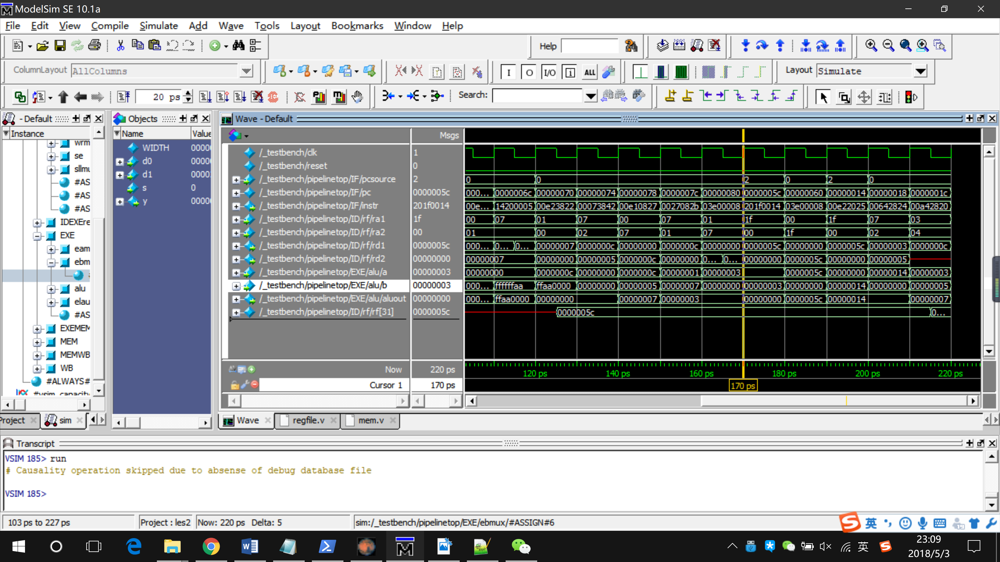

### 6.3.12 lw \$7, 72(\$3) sw \$7, 68(\$3)指令（数据相关、暂停）

这两条是数据相关而必须暂停的指令，因为lw指令需要执行到MEM级才能取得sw需要的数据，所以sw必须在ID级做一次停顿。控制单元则需要发出一次暂停信号，避免pc等寄存器被更改。运行结果如下图所示，pc值为8c和90便是这两条指令，（这两条是在最后两条指令，所以后面的instr没有数据），我们可以看到第三行的wpcir流水线暂停信号在pc刚变为90的时候置1了。而IF、ID级中的流水线寄存器都需要wpcir信号为0时才能够被写入，所以可以看到pc暂停了一个时钟周期、IFID流水线寄存器也被暂停了一个时钟周期。而\$7的值c也通过旁路送回到ID级。在几个时钟周期后，dmem[20]，也就是68(\$3)被写入了c的值。所以说数据相关、暂停的流水线指令执行成功。

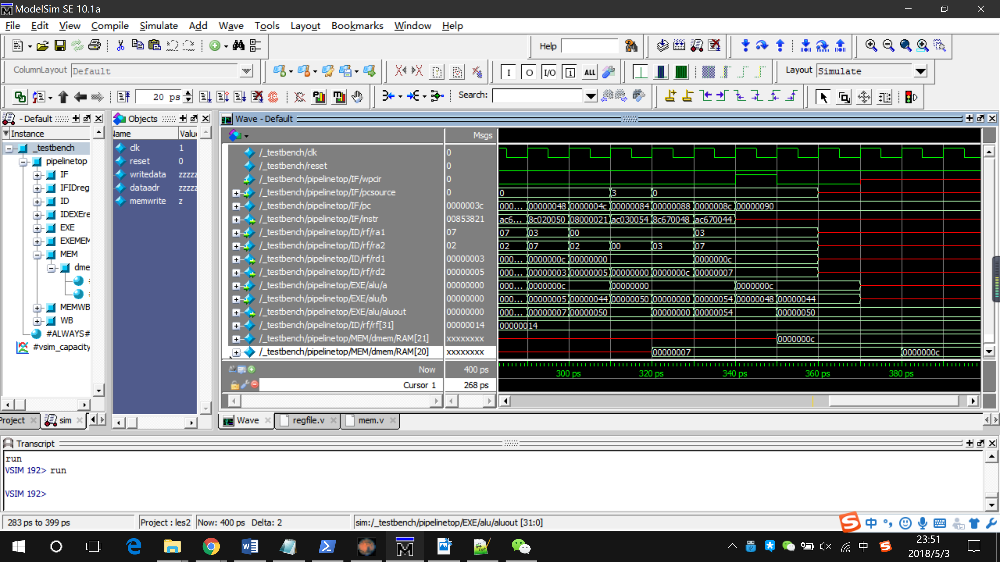

### 6.3.13 jalr \$3指令

\$3中的值为0x30，jalr指令为跳转并链接，应跳转到\$3的位置并保存pc+4至\$31中。运行结果如下图所示，可以看到pc为18的时候，取出jalr指令0060f809，在下一个周期成功将pc改变为30，并在几个周期后，将pc+4也就是1c存入\$31中，所以说jalr也是成功的。

类似前面的样式分析

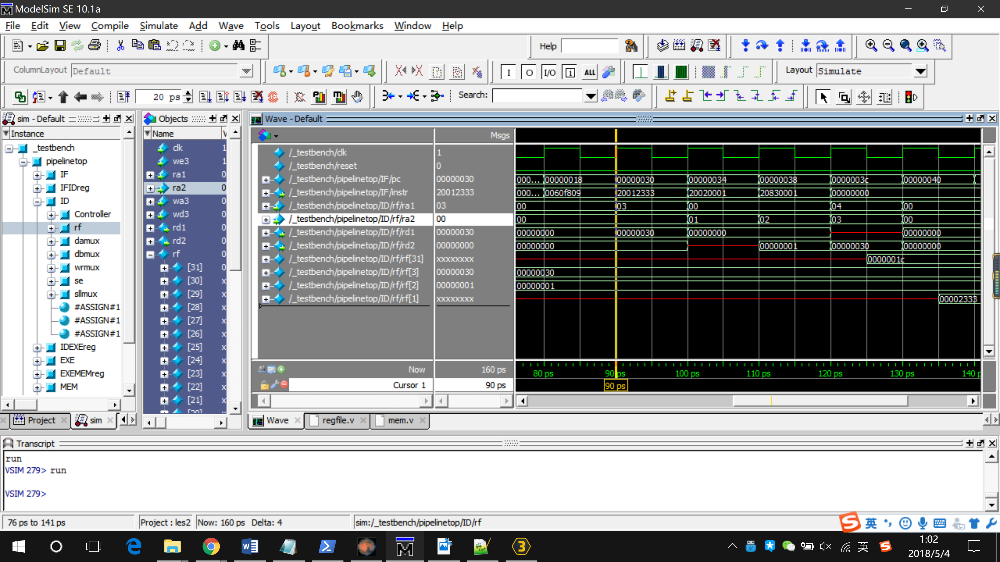

### 6.3.14 addi \$2, \$0, 1与addi \$3, \$2, 1 指令（数据相关，EXE到ID级旁路）

这两条指令使用来检验数据相关中的EXE到ID级的旁路，运行结果如下图所示，在pc为8的时刻，alu计算得出了\$2的值，并通过旁路送到位于ID级的用于选择寄存器输出的四选一多路选择器中，最终在下一个时钟周期又送到了alu的a输入端，证明了EXE到ID级旁路是没问题的。

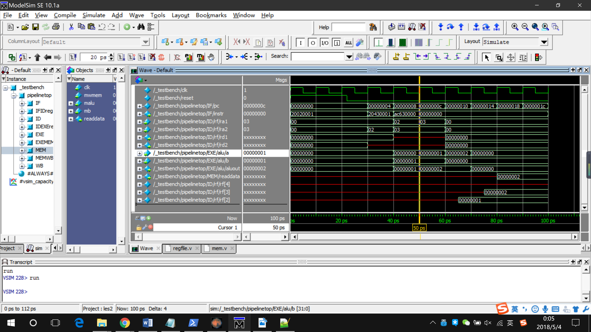

### 6.3.15 lw \$4, 0(\$3)（数据相关，MEM到ID级旁路）

代码段：lw \$4, 0(\$3)

addi \$2, \$0, 1

addi \$3, \$4, 1

在第三条代码addi \$3, \$4, 1
执行到ID级的时候，\$4的值才从dmem中取出来，这时候需要经过MEM级到ID的旁路才能将值送回到ID级。运行结果如下图所示，pc为24、28、2c分别为三条指令处于IF级的时刻，可以看到在pc为30的时刻，\$4通过readdata（dmem的输出）为2，送回到了ID级，并在下一个周期送到alu的a输入端。说明了MEM到ID级的旁路正确。

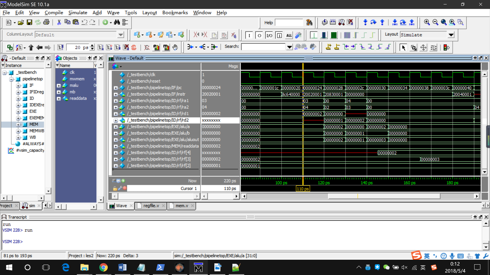

7.课程设计总结
==============

1．
由于是第一次使用Verilog编写程序，在写单周期CPU时会经常出现语法错误，编译器会报大量的错，但后来发现，只要错误一般都出现在最底层报错的文件中。

2.
但有许多错误编译器也无法发现，如变量名错误，使用了未定义的变量，都会通过编译且引发异常。

3．
在程序出现BUG时，需要复现BUG并定位到问题代码，但有时候问题并不一定出现在正在执行的代码片段。如下面这个例子中：

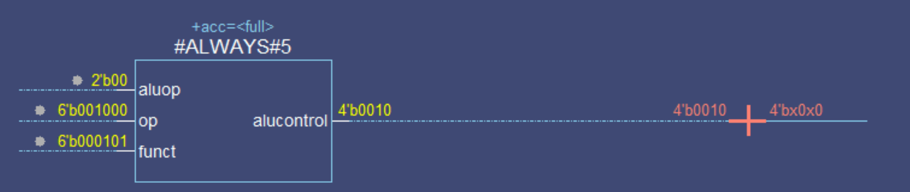

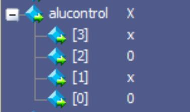

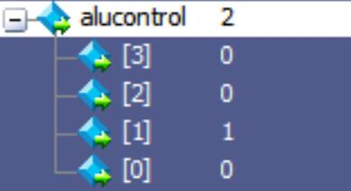

Alucontrol信号在传出module后值便发生了变化。

后来查明原因是alucontrol在另一个地方被错误引用，作为输出。

而且有些隐蔽的漏洞需要执行到特定的指令时才会出现

4.
在做流水线CPU时，由于没有理解EXE级pc还需要+4的原理，便舍弃了这一步。但也就引发了后续的一系列问题：pc不能正确跳转，而是跳转到了\$ra+8的位置，我便改造了pc附近的结构，使执行跳转指令后，跳转到\$ra+4
。虽然能够顺利无误的执行完指令，经过老师的指点后，我发现了问题所在，我去掉了延迟时间槽，在一个时钟周期内访问了两次指令储存器，而访问一次指令寄存器将会消耗大量的时间。在实际CPU运行中，这样会大幅增加一个时钟周期长度。

所以在工业中一般会采用延迟时间槽，在跳转指令后在执行一条无关指令（大部分情况下是空指令）。
