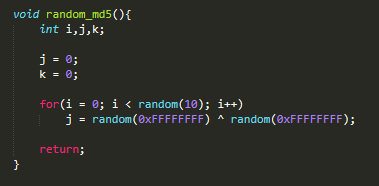

武汉大学网络安全学院

**《嵌入式系统安全实验》课程**

实验报告

实习题目： *基于密码访问的门锁系统*

专业（班）： *16级信安4班*

学生学号： *2016301500327*

学生姓名： *肖 轩 淦*

任课教师： *丁 玉 龙*

２０18 年 12 月 13 日

**目 录**

**第一部分 功能描述 ……………………… 1**

**第二部分 设计方案 ………………………**

**第三部分 安全设计描述 ………………………**

**第四部分 软件设计 ………………………**

**第五部分 设计总结 ………………………**

 第一部分 功能描述
=====================

本次实验选题为基于密码访问的门锁系统，类似于现代智能家居中的智能门锁。在本次实验中，我实现了通过键盘输入密码，若正确开启门锁（电机），若错误给出提示；并通过LED显示提示语以及密码输入的结果；还可以通过连续敲击特殊键，输入正确密码和新密码实现密码的更改。

第二部分 设计方案
=================

为了达到实验目标，在本次实验中我编写了两个程序：主程序 mylock以及监控程序
lock_guard，接下来分开介绍两个程序的设计方案。

1.  **mylock程序**

使用了双线程，其中主线程负责接受输入以及进行hash校验等，led线程负责控制led输出相应的提示语及结果。

主线程的主要架构如下(mylock/main.c)：

1.  **lock_guard监控程序**

功能有检查mylock程序的完整性，软件看门狗，检查密钥文件使用次数。(lock_guard/main.c)

第三部分 安全设计描述
=====================

接下来从抗干扰设计、容错设计、抗攻击设计三个方面来介绍安全设计描述：

1.  **抗干扰设计**

2.  **复位**

**因为本次实验的选题为**基于密码访问的门锁系统，结合现实情况考虑，采取了软件复位，没有使用人工复位。

软件复位在lock_guard/main.c
main函数中实现，复位分为两种：mylock进程重启、整个系统重启。

当看门狗缓冲区达到WCD_RESTART_TIME次未发生变化时，lock_guard将重新启动mylock进程；当连续重启mylock进程MAX_TIME_RESTART_FAIL次仍未成功时，lock_guard将记录日志并重新启动系统。

1.  **睡眠避干扰**

**当检测到一定时间键盘没有按键按下时，mylock将进入到睡眠模式，LED也进入sleep模式，节能并延长LED的寿命。**

>   **相关代码在mylock/main.c 中实现：**

1.  **指令冗余及软件陷阱捕获程序**

**由于arm指令集是定长指令集，所有机器指令向一个Word（4Byte）对齐，EIP即使跑飞，其末两位也只能为0。**

**为了减少EIP跑飞后的影响，我在函数与函数之间留了一定间隔并使用NOP+CALL
error_handel()
异常处理函数来进行填充。由于目前生成的ELF达到3MB+，故只选取了几个函数的间隔进行填充。**

**填充的方式是使用一个较长的无用函数在两个目标函数之间占位，编译成可执行文件后再使用脚本进行Patch。**

**接下来使用mylock/main_misc.c
中checkpwd()与markdown_newpassword()中间的函数间隙进行举例说明。**

**三个函数的位置如下所示：**

Nop_call_1()占位函数使用相同的指令进行填充（为了在编译后生成相同的机器码，方便Patch），在最后加上一条call
异常处理函数（因为call使用间接寻址，让编译器帮助我们找到异常处理函数的相对地址无疑更加方便）。

在IDA中查看生成未剥离符号表的可执行文件：可以看到我们的填充指令具有相同的格式，我们就可以依此把这些指令的机器码都更改为movs
r0,r0(00 00 A0 E1)等价于NOP。

**据此，编写出用来patch的python脚本(嵌入式-Patch_nop+call.py)：**

**查看patch后的可执行文件**

这样实现了函数间隙软件陷阱捕获。

1.  **看门狗及运行监视程序**

**在本次实验中，lock_guard具有软件看门狗的功能，在lock_guard中进行看门狗缓冲区的检验，在mylock中每次循环时，更改看门狗缓冲区的内容。**

Lock_guard mylock

1.  **冷热启动及初始化**

**由于在对于密钥文件具有较为完善的修复机制使用时也有检查机制保障，使得在系统运行的任何时候断电或进程被kill掉，都不会有太大的影响。不过我还是将写密钥及其备份文件当作“原子操作”（只是在设置了文件标志位，但并不能保证其不被打断），在写文件前设置标志，写完文件后清除标志。并在mylock初始化时对标志进行检查，若标志存在，则对密钥文件进行恢复。**

**Mylock/mylock_init.c中在mylock进行初始化时进行检查标志。**

1.  **数据备份**

**以磁盘上储存的keyfile及其备份文件，以及mylock可执行文件及其备份文件举例说明。**

**Keyfile在每次读之前都会进行与其备份文件的对比并修复其中发生错误的文件，在mylock/file_check/file_cmp.c中实现。对比算法：程序进行对比并维护一个f_num大小的数组，数组用来记录与其内容相同的最先一个文件的编号，当相同数量超过f_num/2时，即认为此文件是正确的，并恢复其他不相同的文件。**

**Mylock在每次启动前，也会由lock_guard对mylock可执行文件进行检查，以避免其代码段或数据段发生错误而带来危害。**

**Keyfile及其备份储存的路径为mylock/keyfile/**

**Mylock的备份位置在bak1/, bak2/中。**

**因为本次实验是基于linux操作系统，linux文件管理是基于inode，若是自己在裸机上实现，数据备份应考虑在磁盘不同的位置进行存储，并保持较大的间隔。为了避免磁盘的一块内存区域损坏而导致全部的备份文件丢失。**

1.  **重要数据包含校验码**

**重要数据包括：刚输入进来的明文密码、经过hash后的密码、文件密钥、电机转速等。**

**明文密码、hash密码、文件密钥的压码规则如下，以初始密码123456为例：**

**电机转速校验，位于启动电机前(motor/motorup.c)：**

1.  **容错设计**

2.  **自检**

**检查程序源代码完整性的工作是在lock_guard中实现(lock_guard/main.c)，在每次启动mylock前都会对mylock的elf文件进行完整性检验**

1.  **参数输入容错设计**

**在输入时对缓冲区进行了限制，可以指定最长的密码长度，不会出现缓冲区溢出，(mylock/main.c)**

1.  **输入界面的安全性设计**

2.  **状态转移的条件审核**

**设计的状态转换图如下所示：在进入相关状态时都会进行状态的检查：**

**如在进入motor_up时：**

**在验收时经老师提醒，应使用状态转移序列而非使用全局整型变量。**

**在hash、检查密钥、启动电机时添加状态转移序列的检验。**

**如在motor中，对之前的状态序列进行逐一检查：**

1.  **安全存储**

**对密钥文件进行安全存储，明文密码经过加盐hash后得到真正的密钥，在存入文件时，加密后再存入文件，使用时从文件中解密再开始进行对比。**

**hash密钥在内存与文件中的加解密实现得比较简单，仅使用异或进行加解密，若在真实环境中需使用分组密码及每机不同的分组密码密钥进行加密。**

**实现(file_encry/keyfilemanager.c)：**

1.  **抗攻击设计**

对于旁路攻击的防御：

1.  数据冗余

文件密钥的数据单元及压码在之前均有介绍，储存位置随机暂未实现。

1.  控制冗余

重要函数入口序列检查在之前有过介绍

1.  执行冗余

在程序中，容易受到旁路攻击的是hash过程，及密码hash检查的过程。我在这两处加入了随机数据计算进行干扰。

1.  hash部分，由于采用的是md5散列算法，md5中包含大量的移位异或，

故在每轮变换时插入随机次异或来进行混淆。

1.  密钥对比过程

对比时使用的是加以及异或，故也使用加随机数、异或随机数进行混淆。

1.  掩码技术（加盐）

对于输入的较短的明文密码进行加盐hash，避免攻击者获取到hash值后进行彩虹表攻击。

**对于逆向工程的防御：**

1.  **软件加壳**

通过upx加壳，减小了程序空间，且给攻击者在得到elf文件后的逆向工程增加难度。

**对于爆破密码的防御：**

1.  **设置密码错误次数上限**

在进行密码hash检查时，会记录失败的次数，若达到上限，则拒绝检查密码，不会解密密钥文件。该次数在一定时间后清零。

**对于硬件攻击的防御**：（注：这里硬件攻击指的是攻击者可以在系统运行的某个时刻获取系统的内存或磁盘切片）

1.  **密钥文件再加密**

在前面已经提到密钥在内存中进行对比和在文件中存储是会经过加解密。

1.  **敏感变量及时清理**

敏感变量指的是在储存输入的明文密码、压码、hash值等中间变量。在完成其功能过后立即对其进行清理（填充0），避免攻击者在合法用户输入正常密码离开后得到内存切片直接获取相关信息。

在代码中较多地方都有体现，以处理明文密码缓冲区为例(mylock/main.c)：

在进行hash后立即用0覆盖明文密码缓冲区及其压码。

第四部分 软件设计
=================

操作流程图（本机截图仅为暂时目录，实际应在试验台上进行操作）：

1、在mylock文件夹及lock_guard文件夹中make成功后，进入主文件夹：

2、执行install.sh安装相关驱动

3、执行init.sh将mylock文件copy覆盖其备份（否则启动lock_guard会将新生成的elf文件误认为是发生错误的elf）

4、在主文件夹下执行
./lock_guard/lock_guard启动监控进程，监控进程会启动mylock，或使用脚本./run.sh

1.  试验台上led会出现相关提示语，默认密码123456回车即可启动电机

2.  连续按下6次小键盘上的’.’键进入更换密码模式

3.  输入原密码123456

4.  输入新密码 如000000

5.  重复输入新密码000000，若重复时输错将回到第8步

6.  使用新密码000000启动电机

7.  CTRL+C退出mylock进程，lock_guard会自动重启mylock，此时新密码000000依然有效。

（文件采用相对路径，所以启动进程操作须在主目录下完成）

功能架构图：

包括主进程、监控进程、状态转换图、序列校验算法图

密钥加密流程(mylock/note.txt)：

附件文件说明

主文件夹：

Bak1: mylock二进制文件的备份1

Bak2: mylock二进制文件的备份2

Lock_guard: 监控进程

Mylock: 主进程

Other: 其中用到的一些python脚本，包括密钥文件的计算生成等等

Wcd_buf: 看门狗缓冲区

（Upx加壳工具因较大且网上有就没放进来了）

Mylock文件夹

第五部分 设计总结
=================

通过本次实验，通过自己设计一个嵌入式系统并对其进行安全加固，让我对于嵌入式系统安全，对于其抗干扰设计、容错设计、抗攻击设计有了更深刻的了解。
