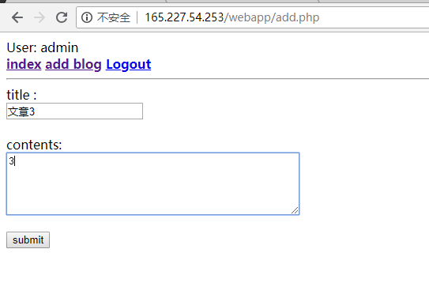

**数据库原理及安全实验报告**

| **姓 名**    | 肖轩淦 | **学号** | 2016301500327 | **班级** | 信安4班 |
|--------------|--------|----------|---------------|----------|---------|
| **实验名称** | WebApp | **日期** | 2019.1.11     |          |         |

**【实验内容及要求】**

**数据库大作业**

**【实验平台】**

**Windows 10**

**Ubuntu 16.04 server x64**

**【实验步骤】**

**在线测试信息：**

<http://165.227.54.253/webapp/index.php>

**管理员账号：admin 密码adminpassword**

**游客账号：guest 密码123456，也可以自行注册**

**效果展示：**

**实现了一个简单的web博客，提供了用户注册的功能。Admin用户可以对博客进行增加、修改、删除操作，而普通用户只能够查看博客。**

**登陆界面：**

**注册界面：**

**登陆成功界面：**

**管理员登陆主页：**

**浏览博客：**

**新增博客界面：**

**修改博客界面：**

**退出登录：**

**游客界面：**

**浏览文章界面:**

**各项要求的实现：**

1.  **不同角色的登陆、访问控制**

**如上文中效果展示，实现了admin和guest及未登录用户的不同权限，admin具有读写权限，guest只具有读权限，未登录用户无任何权限。**

1.  **密码hash**

**使用md5对密码进行hash，如在前端使用hash，降低密码在信道上被截获的危险。**

**数据库内的密码hash存储，防止被脱库获取大量用户明文密码。**

1.  **完整性检查、触发器**

**在blog表定义了三个触发器，如下：**

1.  **对于sql注入的防范**

**在每个输入的地方，均加有防范sql注入。**

1.  **并发测试**

**由于测试性能与主机的性能关系较大，测试主机配置为：1 CPU、1GB内存**

**使用100个并发连接、100000次查询，结果如下：**

**1000个并发、100000次查询，结果：**

1.  **事务的实现**

**在register.php中：**

**新增博客的Add.php中：**

**会判断是否执行成功，失败时回滚数据库。**

1.  **读写锁**

**如在index.php中使用了共享锁：**

1.  **完整性校验**

**User表的完整性约束：**

**Blog表的完整性约束：**

1.  **数据加密**

**配置了Cryptdb：**

1.  **数据库备份与恢复**

**可在phpmyadmin中很方便的备份、恢复。**

**【实验小结】**

通过本次实验，对web应用的开发、数据库的安全操作有了更深的了解。

| **评语： 成绩： 签名：**  **日期： 年 月 日** |
|-----------------------------------------------|

