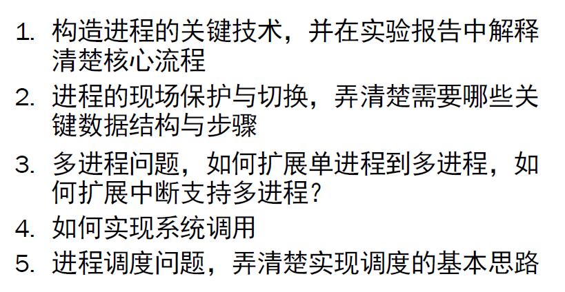
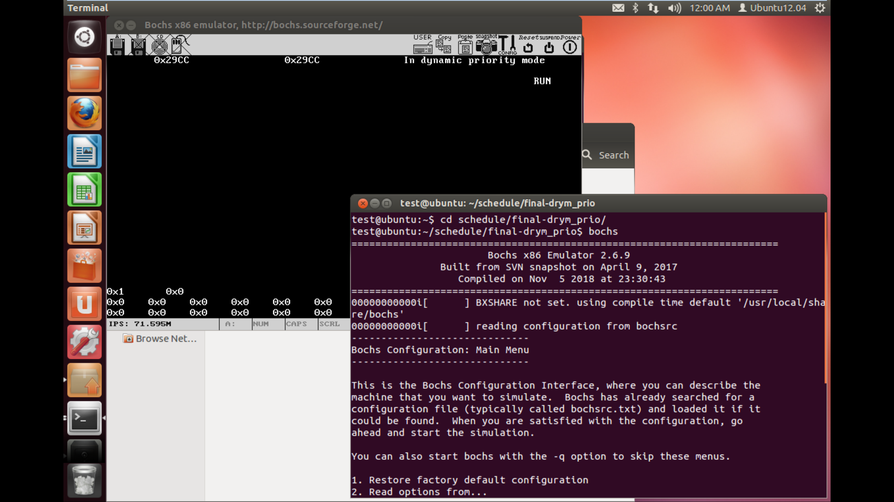

| **武汉大学国家网络安全学院教学实验报告**                                                                                                        |                    |          |            |      |
|-------------------------------------------------------------------------------------------------------------------------------------------------|--------------------|----------|------------|------|
| 课程名称                                                                                                                                        | 操作系统及安全设计 | 实验日期 | 2018.12.25 |      |
| 实验名称                                                                                                                                        | 进程               | 实验序号 | 7          |      |
| 姓 名                                                                                                                                           | 学 号              | 专业     | 年级-班    | 成绩 |
| 肖轩淦                                                                                                                                          | 2016301500327      | 信安     | 4          |      |
| 实验目的及实验内容 （本次实验所涉及并要求掌握的知识；实验内容；必要的原理分析）                                                                 |                    |          |            |      |
| 实验目的：                                                                                                                                      |                    |          |            |      |
| 实验环境及实验步骤 （本次实验所使用的器件、仪器设备等的情况；具体的实验步骤）                                                                   |                    |          |            |      |
| 实验环境： VMware Workstation 12 Pro Ubuntu 12.04.4 LTS 32位 实验步骤：                                                                         |                    |          |            |      |
| 实验过程分析 （实验分工，详细记录实验过程中发生的故障和问题，进行故障分析，说明故障排除的过程及方法。根据具体实验，记录、整理相应的数据表格等） |                    |          |            |      |
| [./media/image3.png](./media/image3.png) 答：（一）构造进程的关键技术：                                                                         |                    |          |            |      |
| 实验结果总结 （对实验结果进行分析，完成思考题目，总结实验成员每人的实验心得体会，并提出实验的改进意见）                                         |                    |          |            |      |
| 实验结果总结： 通过这次实验，对于进程及进程调度有了更深的了解。                                                                                 |                    |          |            |      |
| 教师评语                                                                                                                                        |                    |          |            |      |
| 全组评语：                                                                                                                                      |                    |          |            |      |
|                                                                                                                                                 |                    |          |            |      |
| 个人评语                                                                                                                                        |                    |          |            |      |
| 肖轩淦                                                                                                                                          |                    |          |            |      |
| 教师签名：                                                                                                                                      |                    |          |            |      |

实验内容：

6.
实现一个能够实现分时进程调度和事件触发的进程调度系统，并对所实现的调度进行性能评测分析。

1.  阅读教材

2.  理解代码

3.  实现要求

4.  进程状态的保存（保存现场），包括哪些状态需要保存、何时进行保存、怎样保存。

5.  进程状态的恢复（恢复现场）

6.  进程表的引入

7.  进程栈和内核栈

8.  特权级的变换：ring0 和ring1之间的切换

（二）核心流程：

1、准备好进程体

1.  初始化GDT中的TSS和LDT两个描述符，并初始化TSS

1.  准备进程表（PCB）

填充PCB中的相关信息，如pid、ldt selector即段、eip esp寄存器等

1.  完成跳转，实现ring0到ring1

将cpu交给p_proc_ready这个pcb指向的进程

关键数据结构：

1.  先要将所有的寄存器保存到pcb

1.  判断当前所处于的堆栈

若是当前处于用户堆栈则需要切换，若处于内核堆栈就不需要再进行切换

步骤：（以时钟中断调度为例）

1.  进入中断后，先保存全部寄存器

2.  判断当前所在堆栈，是否需要切换

3.  屏蔽当前中断

4.  置EOI位，开启中断，使cpu能接受其他中断。

5.  进行中断处理，如进行进程调度、计算进程占用cpu时间等等

6.  恢复接收当前中断

7.  中断处理结束，恢复寄存器，iret

答：

1.  扩展单进程到多进程

添加一个进程体

添加任务数组，方便我们对pcb进行初始化

添加新加入的进程

设置进程栈大小

扩展初始化进程表，使之能为所有进程填充pcb

1.  扩展中断支持多进程

需要用一个宏定义来统一中断例程的入口，方便我们扩充。

答：

1.  规定好系统调用的调用号及对应功能的功能号

系统调用号为0x90，功能号有两个，实现了两个功能

1.  编写入口程序

1.  初始化系统调用的中断门

1.  编写int 90h中断例程

1.  编写系统调用功能程序表

1.  编写功能程序

1.  添加函数声明

2.  调用系统调用

在进入中断时，会对当前进程的堆栈进行存储；在退出中断时，会对当前进程的堆栈进行恢复。如下图所示。

在restart时进行堆栈的切换。

所以要实现进程的切换，只需要在中断中将p_proc_ready切换成目标进程即可。

以我实现的动态优先级时间片轮转调度算法为例，在中断中计时，并当时间片用完时，切换至下一个进程以实现进程调度。（下图红框所示，实现当前进程切换）

在中断退出时，restart函数中，恢复了p_proc_ready的堆栈，至此，实现了进程的调度。

6.
实现一个能够实现分时进程调度和事件触发的进程调度系统，并对所实现的调度进行性能评测分析。

使用说明：

Schedule/中有四个子文件夹，分别实现了四种调度算法：

Final-dyna_prio: 动态优先级时间片轮转调度算法

Final-fcfs: 先来先服务算法

Final-nomal: 静态优先级时间片轮转调度算法

Final-sfj: 短进程优先调度算法

（由于不同调度算法是通过宏定义来进行选择的，为了方便后续检查，每种调度算法均编译了一次，故有四个文件夹）

接下来以final-dyna_prio为例，展示接下来的操作。

进入文件夹后，直接bochs即可启动

启动后System_Idle_Process开始运行，等待我们下一步操作。

以下为功能说明：

仅接收按键0-9，各按键功能如下

0：清空屏幕

1-5号进程为实现生产者消费者模型

1：启动生产者进程；若生产者进程已经启动，再按下1则挂起生产者进程

2：启动消费者1进程；若消费者1进程已经启动，再按下2则将它挂起

3：启动消费者2进程；若消费者2进程已经启动，再按下3则将它挂起

4：启动消费者3进程；若消费者3进程已经启动，再按下4则将它挂起

5：启动消费者4进程；若消费者4进程已经启动，再按下5则将它挂起

6-9号进程为进行调度算法性能统计分析，在不同模式下其优先级及所需要的运行时间可能不同。

6：占用固定运行进程1

7：占用固定运行进程2

8：占用固定运行进程3

9：占用固定运行进程4

启动bochs后，按下12345678，启动8个进程

其中，Ready、HangOn、Finish代表各进程现在的状态：就绪、挂起或者结束。

在不同调度算法中，展示出的效果稍有不同，是由于各个调度算法的特性决定的

FCFS：（先来先服务不需要太多信息，故显示的较少）

SFJ：（多出来的一列为剩余运行时间）

Normal：

Dyna_Prio：

代码说明：

由于实现的功能较多，代码也很多，故只选取有代表性的几个地方进行截图说明。

1.  生产者消费者的实现

这里使用

来保护缓冲区。

1.  固定运行时间测试进程的实现

使用

这两个数组进行占用cpu时间的计数，仅当进程在运行时才会计数。

1.  按键就绪挂起进程的实现

位于keyboard.c 键盘中断处理例程。

1-5号进程就绪/挂起直接将其加入/移除进程链表即可，6-9号进程因为会退出就绪时，需要重新填充pcb

1.  退出进程的系统调用实现：

1.  FCFS调度：

1.  SFJ

1.  静态优先级时间片轮转调度

1.  动态优先级固定时间片轮转调度算法

